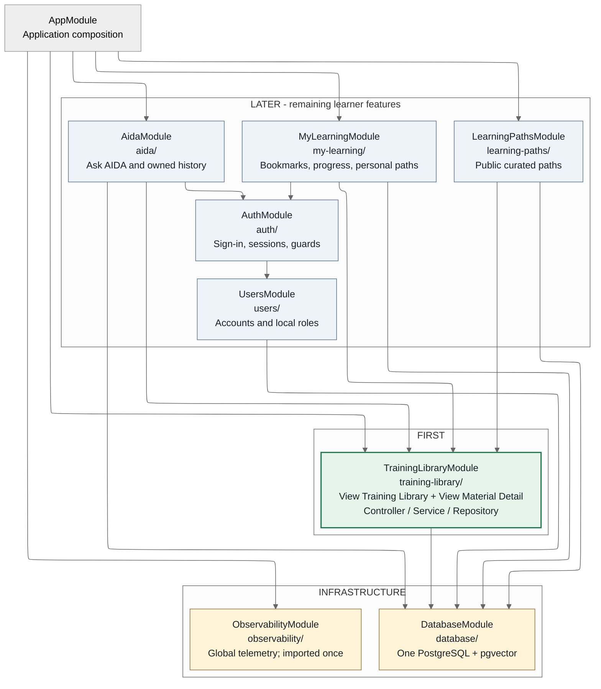

# HPC Learning Hub: NestJS Module Architecture

**Shared design revision: `feature-boundaries-2026-09-04`.** Proposed code
organization, not implemented features or approval of candidate contracts.
Read the [shared feature mapping and naming decisions](feature-module-mapping.md)
alongside the [paired Next.js diagram](https://github.com/sdsc-hpc-training-dev/hpc-learning-hub-frontend/blob/master/docs/architecture/nextjs-modules.md).

Start with **View Training Library** and **View Material Detail**, both in
`TrainingLibraryModule`. A NestJS module groups related controllers and providers;
it is not a page, database table, or separately deployed service.

## Module Overview

Every arrow means **NestJS imports**, allowing use of exported providers, not
HTTP or data flow. `AppModule` composes the features; their imports load supporting
modules transitively. Repositories stay private. FIRST is sufficient for both
initial views; LATER means subsequent increments, not removal from MVP.
Infrastructure is backend-only, not a set of portal features.



[Open the zoomable SVG](assets/nestjs-modules.svg). Read the tables below when
viewing on a small screen. For the first increment, App imports Training Library
and Observability only; add the LATER imports as those capabilities are built.
Observability registers request instrumentation once and exports global telemetry.
All other provider dependencies are explicit imports shown above.

## First Two Feature Paths

All folders, component names, controllers and services below are **proposed**.
Persistence names refer to the [existing domain model](../sdsc-learning-hub-persistence-class-diagram.md),
not implemented tables. HTTP operations come from baseline/candidate
[HTTP-01/02](../contracts/system-contracts-v0.2-candidate.md#HTTP-01);
exact DTOs, filters, pagination and resource serialization remain D-02/D-11.
No new finalized endpoint is introduced by a class name.

| Screen                       | Next.js entry                                                                                                          | Gateway behavior                                                                                                                                        | Persistence responsibility                                                                                                                                                 |
| ---------------------------- | ---------------------------------------------------------------------------------------------------------------------- | ------------------------------------------------------------------------------------------------------------------------------------------------------- | -------------------------------------------------------------------------------------------------------------------------------------------------------------------------- |
| **1. View Training Library** | `app/materials/page.tsx` composes `features/training-library/TrainingLibraryView.tsx` and `TrainingLibraryFilters.tsx` | `TrainingLibraryController` -> `TrainingLibraryService` -> `TrainingLibraryRepository`: public search, filters, counts and canonical material summaries | Read `TrainingMaterial`, vocabularies/aliases and explicit material joins in the active `CatalogSnapshot`. Python worker writes imported records; Gateway owns migrations. |
| **2. View Material Detail**  | `app/materials/[materialId]/page.tsx` composes `features/training-library/MaterialDetail.tsx`                          | Same controller/service/repository: canonical material lookup and attached resources                                                                    | Read `TrainingMaterial`, `MaterialResource`, `ContentResource`, `ContentResourceFile` and related metadata joins. Same importer/migration boundary.                        |

Both flows are **Next.js -> Gateway -> relational PostgreSQL reads**. Neither
requires login, AIDA, vector retrieval, nor S3 reads at request time. Resource
links navigate to verified canonical destinations; missing links remain missing.
An optional later save control or AIDA drawer must not block either public view.

## Responsibilities And Reuse

| Module                  | Controller / service boundary and consumers                                                                                                                                                                   | Persistence or support                                                                                                                                                        |
| ----------------------- | ------------------------------------------------------------------------------------------------------------------------------------------------------------------------------------------------------------- | ----------------------------------------------------------------------------------------------------------------------------------------------------------------------------- |
| `TrainingLibraryModule` | `TrainingLibraryController` and exported `TrainingLibraryService`. Also serves Events & Recordings, Programs & Series, Start Here selections, path material validation and AIDA `catalog_api`/citation links. | Private read-only repository for materials/resources, events/series, vocabularies, aliases, explicit joins and snapshot identity. No public catalog-write or import endpoint. |
| `LearningPathsModule`   | `LearningPathsController` -> `LearningPathsService`; public curated paths and ordered steps for Learning Paths and Start Here. Uses Training Library for material references.                                 | `CuratedLearningPath`, `CuratedPathItem`. Controlled Gateway-side population is still D-12, not worker ingestion or an authoring UI.                                          |
| `MyLearningModule`      | `MyLearningController` -> `MyLearningService`; authenticated bookmarks, progress and personal path editing. Uses Auth guards and Training Library validation.                                                 | `Bookmark`, `LearningProgress`, `PersonalLearningPath`, `PersonalPathItem`; owner-scoped Gateway writes. No public/private visibility workflow.                               |
| `AuthModule`            | `AuthController` -> `AuthService`; CILogon, sessions, `/me`, logout and maintainer smoke check. Exports session/role guards; uses `UsersService`.                                                             | Protocol/session boundary; no invented session table. D-04 governs exact routes, cookies and role matrix.                                                                     |
| `UsersModule`           | Exported `UsersService`; private account repository, no public controller needed.                                                                                                                             | `User`, `AuthIdentity`, `UserRole`; Gateway account operations, one local role, `LEARNER` default. No client/claim-based elevation.                                           |
| `AidaModule`            | `AidaController` -> `AidaService`; internal router, retrieval, synthesis, evidence and conversation services. Uses Training Library in-process, never HTTP back into itself.                                  | Read imported `ContentChunk`/`ChunkEmbedding`; write owned conversations, messages, runs, citations, feedback and coverage gaps.                                              |
| `DatabaseModule`        | Export database client/transactions, not business repositories. ORM remains undecided.                                                                                                                        | One connection configuration and one Gateway-owned migration history.                                                                                                         |
| `ObservabilityModule`   | Global telemetry, request IDs, redacted logs, bounded metrics and standard error handling.                                                                                                                    | Not a second conversation store. No secrets or assembled prompts in logs.                                                                                                     |

Events are dated `EventEdition` records; Programs & Series uses `EventSeries`.
Recordings are material resources. These reuse Training Library's imported data,
so no `EventsModule`, `ProgramsModule`, new programs table or per-page backend
module is needed now. Start Here is frontend composition, not a backend module.

## Proposed Folders

Representative files only; create what an increment needs. Controllers receive
HTTP, services own behavior, repositories/query adapters access the database.
DTOs are wire contracts, not ORM models. Each feature keeps its tests beside it.

```text
src/
  main.ts                              # existing starter bootstrap
  app.module.ts                        # existing; proposed imports above
  training-library/                    # FIRST: both public views
    training-library.module.ts
    training-library.controller.ts
    training-library.service.ts        # exported reusable query boundary
    persistence/training-library.repository.ts
    persistence/snapshot.query.ts      # active identity, not activation
    dto/material-query.dto.ts           # complete under D-02
    dto/material-response.dto.ts        # complete under D-02/D-11
    training-library.service.spec.ts
  learning-paths/                       # LATER: public curated paths
    learning-paths.module.ts
    learning-paths.controller.ts
    learning-paths.service.ts
    persistence/learning-paths.repository.ts
  my-learning/                          # LATER: authenticated continuity
    my-learning.module.ts
    my-learning.controller.ts
    my-learning.service.ts
    persistence/my-learning.repository.ts
  auth/
    auth.module.ts
    auth.controller.ts
    auth.service.ts
    session.service.ts
    cilogon.client.ts
    guards/                            # required session and roles
  users/
    users.module.ts
    users.service.ts
    persistence/users.repository.ts
  aida/
    aida.module.ts
    aida.controller.ts
    aida.service.ts
    router/router.service.ts           # proposed port, release-gated
    retrieval/retrieval.service.ts
    retrieval/chunks.query.ts           # imported rows read-only
    synthesis/synthesis.service.ts
    synthesis/evidence.service.ts
    conversations/conversations.service.ts
    conversations/conversations.repository.ts
    clients/nrp.client.ts              # shared inside AIDA
  database/
    database.module.ts
    database.provider.ts               # library choice still open
  observability/
    observability.module.ts
    telemetry.service.ts
migrations/                            # proposed; Gateway authority only
test/                                  # HTTP/DB integration fixtures
```

No generic Controllers/Services/Persistence module, circular `forwardRef()`
workaround, or separate deployment per feature is proposed.

## Data And AIDA Boundaries

The separate **Python job/container** reads static Snapshot v3 from local ZIP
or S3 and writes approved catalog, aliases, explicit joins, lifecycle metadata,
supplied chunks and generated embeddings directly through restricted DB grants.
It neither calls a Gateway ingestion endpoint nor imports NestJS code. It does
not own users, conversations, personal paths or curated paths. Gateway owns
all migrations; DatabaseModule does not take domain ownership from features.

Preserve `EventSeriesEdition`, `EventMaterial`, `MaterialResource`,
`MaterialTopic`, `MaterialTool`, `MaterialSystem`, `MaterialInstructor` as
explicit joins, not duplicate generic relationship serving tables. Renaming
modules does not rename stored classes, change constraints, or resolve D-05's
chunk uniqueness collision. Do not discard supplied chunks or select a new key.

| Later AIDA strategy | Internal responsibility                                                                                                                                                                            |
| ------------------- | -------------------------------------------------------------------------------------------------------------------------------------------------------------------------------------------------- |
| `catalog_api`       | Same `TrainingLibraryService` relational queries and canonical links as public browsing; no duplicate catalog engine.                                                                              |
| `general_rag`       | Active-snapshot non-transcript retrieval with approved allowlist and compatible embeddings; D-09/D-10 and ingestion D3/D4 remain open.                                                             |
| `transcript_rag`    | Transcript-kind plus validated recording scope and compatible embeddings. Video-to-transcript association and missing/conflicting/unresolved scope remain D-10/ingestion D4; no unscoped fallback. |
| `abstain`           | Controlled unsupported response; no required retrieval/model call. Weak evidence handling remains contract-governed.                                                                               |

`route` and `answerMode` are distinct. Evidence/citation validation uses canonical
IDs; conversation summaries are context, not evidence. Authenticated history,
deletion and feedback are owner-scoped; guest one-turn AIDA remains D-03 and
does not imply durable guest history. Keep retrieval/synthesis/conversations
inside AIDA, not separate NestJS modules. NRP is server-side; importer embeddings
are offline. The NestJS classifier port is not production-ready until D-08's
artifact, parity and quality gates are approved and passed. No GraphRAG/Neo4j.

## Build Order And Open Gates

1. Agree the two public operations' DTOs/query/resource behavior (D-02/D-11)
   and required catalog migration/import mappings (D-01/D-05). Build Library
   and Detail together with canonical fixture IDs, public error/empty/not-found
   states, filter context and resource links. Do not require chunk/embedding
   integration to test these relational views; blocked importer work stays gated.
2. Add public Learning Paths, Events & Recordings, Programs & Series and Start
   Here using the same queries. D-12 still gates curated source/IDs/population.
3. Add Auth/My Learning and AIDA in separate increments. Preserve all decision
   gates: auth D-04, history D-06, delivery D-07, classifier D-08, embeddings
   D-09 and scope D-10. Only the maintainer authorization smoke surface is needed.

Use the [candidate entrypoint](../contracts/agent-entrypoint.md),
[v0.2 candidate](../contracts/system-contracts-v0.2-candidate.md),
[decision register](../contracts/decisions-needed.md) and
[ingestion companion](../specs/ingestion-worker.md). They remain CANDIDATE;
[v0.1](../system-contracts-v0.1.md) is the unchanged baseline. No ORM, final HTTP
schema, session store, cache, deployment or new product workflow is selected here.

## Evidence And Review

Fetched Gateway `main` at `07374369f95a4d342647dc1fb428e64ef1a02e63`:
`package.json` and `src/` still implement only NestJS 11 starter Hello World,
with empty module imports. No feature modules, ORM, migrations or OpenAPI exist.
The [shared mapping](feature-module-mapping.md) pins frontend and UI evidence.

Yesterday's [independent review](review/independent-review.md),
[dispositions](review/dispositions.md) and [author handoff](review/author-handoff.md)
apply to the **prior revision**, not this naming/split revision; retained unchanged.
One bounded cross-diagram self-review checked the shared mapping, both initial
paths, ownership and rendered arrows/labels; corrections improved label wrapping
and group headings. No new independent review was performed. Mermaid is the
source of the generated SVG, using the cached
Mermaid CLI 11.17.0 toolchain documented in the paired frontend's prior handoff.
