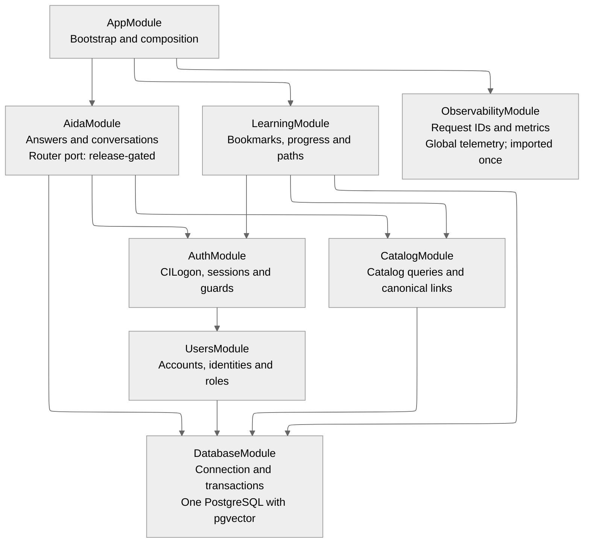

# HPC Learning Hub: NestJS Module Architecture

**Status:** Proposed implementation structure; one independent review completed
with no findings. This is not team approval or a claim of implementation.
**Source baseline:** `fda21d619dcc5119f1133501bafa8cc7e800c7cf`.

This diagram answers **where code belongs**, not which tables exist or which
services must be deployed. The [persistence model](../sdsc-learning-hub-persistence-class-diagram.md)
still defines the stored data. The [system contracts](../system-contracts-v0.1.md)
define the behavior across application boundaries.

At the pinned baseline, this repository contains the NestJS starter: an empty
`AppModule.imports`, a Hello World controller/service, and starter tests. It
does not yet contain feature modules, an ORM, migrations, CILogon integration,
or AIDA runtime code. Everything below except that starter is a proposal.

## Module Dependency Overview

**Every arrow means:** the module at the tail lists the module at the arrowhead
in its NestJS `imports`. It can use that module's exported providers; it cannot
reach into its private repositories. Arrows are **not** HTTP calls, data flow,
table relationships, or deployment connections. `AppModule` imports modules to
compose the application, even when it does not inject their exports itself.

`ObservabilityModule` is the one explicit global-provider exception: import it
once in `AppModule`, register request instrumentation once, and export telemetry
globally. The diagram does not draw a false import from every feature to it.
All other provider dependencies use the imports shown. This follows Nest's
[module imports/exports semantics](https://docs.nestjs.com/modules).

`AppModule` imports AIDA, Learning, and Observability. Auth and Catalog are
reached through the first two modules, Users through Auth, and Database through
its consumers. Nest loads those modules and their controllers transitively;
their providers are not thereby made global.



[Open the rendered SVG](assets/nestjs-modules.svg).

### Module Responsibilities And Exports

| Module                | Responsibilities                                                                                                                                                | Exports consumed by other modules                                                                                                    |
| --------------------- | --------------------------------------------------------------------------------------------------------------------------------------------------------------- | ------------------------------------------------------------------------------------------------------------------------------------ |
| `AppModule`           | Compose the modules shown. `main.ts` configures validation, API prefix, and OpenAPI when implemented.                                                           | None                                                                                                                                 |
| `AuthModule`          | CILogon callback/code exchange, application sessions, `/me`, and authentication/role guards. Provide only the Maintainer authorization smoke-test endpoint now. | Required-session guard, optional-session guard, roles guard; current-user/role decorators and types are ordinary TypeScript imports. |
| `UsersModule`         | Resolve CILogon issuer/subject to the local user; create a learner by default; own account and role rules. No public controller in this proposal.               | `UsersService`, called by Auth.                                                                                                      |
| `CatalogModule`       | Read imported catalog data, filters/counts, active snapshot identity, and validated canonical material/resource links. No public catalog-write API.             | `CatalogService`, shared by its controller, Learning, and AIDA.                                                                      |
| `LearningModule`      | Owner-scoped bookmarks, progress, and personal paths; public curated-path reads.                                                                                | None needed initially.                                                                                                               |
| `AidaModule`          | Request scope, routing, retrieval, synthesis, citations, conversation history, feedback, and coverage gaps.                                                     | None needed initially; its controller is the HTTP boundary.                                                                          |
| `DatabaseModule`      | Configure the selected ORM/client connection and transaction provider. Migrations remain a separate versioned repository artifact.                              | Database client/connection and transaction helper; exact provider names depend on the ORM decision.                                  |
| `ObservabilityModule` | Request IDs, standard error envelope, redacted logs, and bounded latency/error metrics. Register cross-cutting interceptors/filter once.                        | Global `TelemetryService`; not a business-data repository.                                                                           |

The `/me` endpoint sits in `AuthController`, which delegates to `UsersService`.
That avoids `UsersModule` importing `AuthModule` back just to protect a user
controller. Authentication identifies the caller; application rules assign
exactly one role. CILogon claims and request bodies cannot grant elevated roles.
Initial admin provisioning remains a controlled administrative process, not a
public sign-up option.

Protected Learning and AIDA endpoints use Auth's exported guards and scope
every query to the authenticated user. Public curated paths and catalog reads
remain public. Guest one-turn AIDA is gated by
[D-03](../contracts/decisions-needed.md#d-03-guest-aida); an optional-session
guard is a proposed mechanism only if that capability is approved. Persisted
conversations and feedback require an authenticated owner.

## Proposed Folder Layout

These are representative files, not instructions to generate an empty file
for every table. A module groups a feature; its controller receives HTTP, its
service owns behavior, and its repository/query adapter accesses PostgreSQL.
Unit tests stay beside the code. Integration and HTTP contract tests use `test/`.

```text
src/
  main.ts
  app.module.ts
  auth/
    auth.module.ts
    auth.controller.ts                 # callback, session, /me, role smoke check
    auth.service.ts
    session.service.ts                 # session mechanism still to be agreed
    cilogon.client.ts
    guards/session.guard.ts
    guards/optional-session.guard.ts
    guards/roles.guard.ts
    decorators/current-user.decorator.ts
    decorators/roles.decorator.ts
    dto/me-response.dto.ts
    auth.service.spec.ts
  users/
    users.module.ts
    users.service.ts
    persistence/users.repository.ts    # User and AuthIdentity together
    persistence/user.model.ts          # representative ORM mapping, not DTO
    users.service.spec.ts
  catalog/
    catalog.module.ts
    catalog.controller.ts             # materials, resources, facets and events
    catalog.service.ts                # exported shared query boundary
    persistence/catalog.repository.ts
    persistence/snapshot.query.ts     # read active snapshot; no import endpoint
    persistence/training-material.model.ts
    dto/material-query.dto.ts
    dto/material-response.dto.ts
    catalog.service.spec.ts
  learning/
    learning.module.ts
    learning.controller.ts            # /me bookmarks, progress and paths
    curated-paths.controller.ts       # public /learning-paths reads
    learning.service.ts
    persistence/learning.repository.ts
    dto/save-bookmark.dto.ts
    dto/update-path.dto.ts
    learning.service.spec.ts
  aida/
    aida.module.ts
    aida.controller.ts
    aida.service.ts                    # orchestrates one answer
    dto/question.dto.ts
    dto/answer.dto.ts                  # route differs from answerMode
    conversations/conversations.service.ts
    conversations/conversations.repository.ts
    router/router.service.ts          # proposed port; gated by parity tests
    router/router-artifact.loader.ts
    router/router.service.spec.ts
    retrieval/retrieval.service.ts
    retrieval/chunks.query.ts         # pgvector adapter; imported tables read-only
    synthesis/synthesis.service.ts
    synthesis/evidence.service.ts     # grounding and canonical citation checks
    clients/nrp.client.ts             # shared inside AIDA, not copied per route
    aida.service.spec.ts
  database/
    database.module.ts
    database.provider.ts              # ORM/client and transaction plumbing only
  observability/
    observability.module.ts
    telemetry.service.ts
    request-context.interceptor.ts
    api-exception.filter.ts
migrations/                           # proposed authoritative migration location
test/
  auth.e2e-spec.ts
  catalog.e2e-spec.ts
  learning.e2e-spec.ts
  aida.e2e-spec.ts
  retrieval.integration-spec.ts
  fixtures/                          # small catalog, vectors and parity fixtures
```

The ORM is not selected yet. `*.model.ts`, `database.provider.ts`, and
`migrations/` are placement guidance, not an invented TypeORM/Prisma decision.
Adapt those names once the team selects the library; do not maintain two
schemas. Feature mappings belong with their owning feature. All migrations
share one ordered history, reviewed by the Gateway migration owner.

There is no `ControllersModule`, `ServicesModule`, or all-business-logic
`PersistenceModule`. Router, retrieval, synthesis, and conversation folders
are services inside `AidaModule`, not extra NestJS modules or deployments.
Do not introduce `forwardRef()` to hide a dependency cycle in this proposal.

## Persistence Ownership

"Owner" below means the feature responsible for the mapping and query contract.
It does not mean that the runtime service is permitted to write imported data.
Srujam coordinates **all** migrations. The Python worker consumes that schema;
it does not import TypeScript code or define an independent permanent schema.

| Persistence group / classes                                                                                                                                                                      | NestJS owner and boundary                                                                                                     | Who writes the records?                                                                                                                       |
| ------------------------------------------------------------------------------------------------------------------------------------------------------------------------------------------------ | ----------------------------------------------------------------------------------------------------------------------------- | --------------------------------------------------------------------------------------------------------------------------------------------- |
| `User`, `AuthIdentity`, `UserRole`                                                                                                                                                               | Users; exported `UsersService`. Auth owns the CILogon/session protocol, not a second user repository.                         | Gateway account/authorized role operations. `LEARNER` default; one role per user.                                                             |
| `CatalogSnapshot`, `SnapshotImportRun`, `SnapshotImportError`                                                                                                                                    | Catalog schema/query ownership; `CatalogService` exposes the active snapshot identity, not importer mutation methods.         | External Python importer under restricted permissions.                                                                                        |
| `TrainingMaterial`, `ContentResource`, `ContentResourceFile`, `EventSeries`, `EventEdition`, `Person`, `Topic`, `Tool`, `System`                                                                 | Catalog; exported `CatalogService`.                                                                                           | Python importer. Gateway reads only.                                                                                                          |
| `EventSeriesAlias`, `TopicAlias`, `ToolAlias`, `SystemAlias`; `EventSeriesEdition`, `EventMaterial`, `MaterialResource`, `MaterialTopic`, `MaterialTool`, `MaterialSystem`, `MaterialInstructor` | Catalog; private mappings/repository behind `CatalogService`. Real foreign keys, no duplicate polymorphic relationship table. | Python importer. Gateway reads only.                                                                                                          |
| `Bookmark`, `LearningProgress`, `PersonalLearningPath`, `PersonalPathItem`, `CuratedLearningPath`, `CuratedPathItem`                                                                             | Learning; private repository. Catalog material validation uses `CatalogService`.                                              | Gateway learner operations; curated-path population is a controlled Gateway-side concern, not a worker task. No new authoring UI is proposed. |
| `ContentChunk`, `ChunkEmbedding`                                                                                                                                                                 | AIDA retrieval mappings and `chunks.query.ts`. Canonical catalog validation/link resolution uses `CatalogService`.            | Python importer loads supplied chunks without rechunking and creates embeddings. Gateway retrieval is read-only.                              |
| `AidaConversation`, `AidaMessage`, `AidaAnswerRun`, `AidaCitation`, `AidaFeedback`, `AidaCoverageGap`                                                                                            | AIDA conversation service/repository; private to `AidaModule`.                                                                | Authenticated Gateway requests, owner-scoped. Anonymous turns are transient.                                                                  |

DatabaseModule owns the connection, not all these domain repositories.
Observability owns operational telemetry, not a second copy of conversations.
Keep canonical IDs intact, record exact snapshot/model versions, and retain
the persistence model's constraints and deletion rules, subject to the
[candidate decision register](../contracts/decisions-needed.md): D-05 blocks the
incompatible chunk uniqueness constraint identified in Snapshot v3. Do not drop
canonical chunks or silently choose a replacement key. Gateway control of curated
paths does not settle their initial source, IDs, or population process (D-12).
Session storage is not
specified in the current persistence model; do not invent a session table here.

## AIDA Behavior Inside The Module

`AidaService` resolves the caller and allowed conversation/UI scope, obtains
the active snapshot identity through `CatalogService`, and coordinates these
services. This is runtime behavior, separate from the diagram's import arrows.

| Route            | Retrieval responsibility                                                                                                                                                                                                                                                                                                                                |
| ---------------- | ------------------------------------------------------------------------------------------------------------------------------------------------------------------------------------------------------------------------------------------------------------------------------------------------------------------------------------------------------- |
| `catalog_api`    | Call the same exported `CatalogService` as the public catalog controller. No duplicate catalog engine and no HTTP request back into this Gateway. Counts, IDs, filters, and links are relational queries; prose formatting cannot change facts.                                                                                                         |
| `general_rag`    | `RetrievalService` uses `chunks.query.ts` over the active snapshot's approved non-transcript chunks. The proposed set (`catalog_metadata`, `repository_session`, `slides`) remains gated by D-10 and ingestion D4. Match the approved indexed embedding configuration.                                                                                  |
| `transcript_rag` | Require `sourceKind = transcript`, active snapshot, compatible embedding configuration, and validated recording scope. Missing, conflicting, or unresolved scope, including video-to-transcript association, is gated by D-10 and ingestion D4. Do not broaden retrieval; the controlled clarification, abstention, or error outcome remains undecided. |
| `abstain`        | No required retrieval/model call. Return a controlled response for unsupported requests. Empty, weak, or uncitable retrieved evidence can also force abstention after another route was selected.                                                                                                                                                       |

One private `NrpClient` is shared by router query embeddings, retrieval query
embeddings, and synthesis. Reuse an embedding only when model, dimensions,
normalization, and input are identical. Worker document embeddings are created
offline, not regenerated during requests. NRP timeouts and retries must be
bounded and measured separately from local routing and database time.

Explicit recording context takes precedence over text classification under the
router contract. Scope IDs must resolve canonically. The synthesis/evidence
services may cite only evidence actually supplied to the answer. Conversation
summaries provide context, not evidence. Persist the answer, route, support mode,
citations, feedback, coverage gaps, and bounded metrics, not assembled prompts
or secrets. No timestamp links are promised by this snapshot.

### Router Status And Release Gate

The [router verdict](../aida-router-architecture-verdict.md) describes an
existing **separate local Python prototype**, with an in-memory catalog, NumPy
vectors, and a localhost HTTP server. It is not a deployed Gateway dependency.
This diagram does not add a Python sidecar or pretend the prototype already
uses the proposed PostgreSQL repositories.

The target NestJS `RouterService` consumes a checksummed, language-neutral
classifier artifact produced by offline Python training/evaluation. Do not
load `joblib` in Node or train a classifier in a request. Promote the port only
after the reported validation discrepancy is reconciled, artifact/configuration
versions are frozen, and Python/TypeScript parity and failure/context tests pass.
The source gate requires all 120 cached embedding route labels to agree and
golden probabilities within `1e-6`. Exact quality thresholds still need approval.
Until then, the port remains proposed, not the default production router.

## External Boundaries

- **Python ingestion worker:** separate offline application/container. Reads an
  immutable local ZIP or S3 object; verifies exact snapshot ID/checksum; writes
  catalog, explicit joins, import lifecycle, chunks, and embeddings directly to
  PostgreSQL with its restricted importer role. No NestJS ingestion controller
  or worker module is needed. It cannot read/write users or learner/AIDA history.
- **PostgreSQL with pgvector:** one database, one authoritative migration history.
  Runtime repositories and the importer have different permissions. No second
  vector database or shared external database for PR tests.
- **S3:** immutable source/archive for the worker only. Normal catalog/user
  requests do not download snapshots. Snapshot updates/automation are not part
  of this module implementation milestone.
- **CILogon:** Auth's server-side client performs the code exchange. The browser
  follows the login redirect, but frontend JavaScript receives no provider
  tokens/client secret. The Gateway issues its secure HttpOnly, SameSite session
  cookie and applies local roles.
- **NRP:** AIDA calls approved embedding/generation APIs server-side; the worker
  separately calls the approved embedding endpoint. No frontend keys/calls.
  Offline Python training/evaluation produces the router artifact, not a new
  live routing service.

No submission/draft/moderation modules, GraphRAG, Neo4j, social sharing, or new
cache infrastructure is added by this proposal.

## First Implementation Checks

1. Apply Gateway-owned migrations, then let the worker import one material,
   resource, supplied chunk, and deterministic test embedding in a disposable DB.
2. Read the material publicly through Catalog's HTTP DTO and through its exported
   service. Test the same IDs and links for both callers.
3. Reject guests/cross-user access to personal records; prove sign-up cannot
   self-assign a role and the Maintainer smoke endpoint enforces its role.
4. Test General and Transcript RAG filters independently, plus weak evidence,
   invalid scope, owner-scoped conversation reads/deletes, and NRP failure DTOs.
5. Test the proposed router port against frozen Python fixtures without live
   NRP. Keep measured provider canaries separate from deterministic PR checks.

## Choices Still Open

- ORM/migration library, session mechanism/store, and exact OpenAPI pagination
  and filtering parameters.
- Synchronous versus streamed answers, retention/deletion policy, final router
  quality thresholds/artifact, and measured NRP batching/retry limits.
- How curated paths are initially populated on the Gateway side. The worker
  specification explicitly excludes them; this document adds no authoring flow.

The contracts call the pre-activation gate "ready" in prose, but the persisted
snapshot enum has `VALIDATED` and `ACTIVE`, not `READY`. No new enum value or
schema change is introduced here. These choices do not change the import graph.

For implementation, read the [candidate contract entrypoint](../contracts/agent-entrypoint.md)
and [technical ingestion companion](../specs/ingestion-worker.md) together. Their
linked decision registers govern unresolved capabilities; this architecture
proposal does not close those gates. The combined publication review and
correction dispositions are recorded in [the release review](../review/contracts-ingestion-dispositions.md).

## Pinned Sources

The [independent review](review/independent-review.md) and
[author dispositions](review/dispositions.md) record the single review round.

The links below freeze the evidence for this proposal; relative links above are
for day-to-day navigation. Earlier source titles still say SDSC Learning Hub;
this document uses the requested HPC Learning Hub project name.

- [Persistence model](https://github.com/sdsc-hpc-training-dev/hpc-learning-hub-apigateway/blob/fda21d619dcc5119f1133501bafa8cc7e800c7cf/docs/sdsc-learning-hub-persistence-class-diagram.md)
- [System contracts, including router release gates](https://github.com/sdsc-hpc-training-dev/hpc-learning-hub-apigateway/blob/fda21d619dcc5119f1133501bafa8cc7e800c7cf/docs/system-contracts-v0.1.md)
- [Implementation brief and ownership](https://github.com/sdsc-hpc-training-dev/hpc-learning-hub-apigateway/blob/fda21d619dcc5119f1133501bafa8cc7e800c7cf/docs/intern-implementation-brief.md)
- [Python ingestion worker specification](https://github.com/sdsc-hpc-training-dev/hpc-learning-hub-apigateway/blob/fda21d619dcc5119f1133501bafa8cc7e800c7cf/docs/specs/ingestion-worker.md)
- [Router architecture verdict](https://github.com/sdsc-hpc-training-dev/hpc-learning-hub-apigateway/blob/fda21d619dcc5119f1133501bafa8cc7e800c7cf/docs/aida-router-architecture-verdict.md)
- [Actual starter AppModule](https://github.com/sdsc-hpc-training-dev/hpc-learning-hub-apigateway/blob/fda21d619dcc5119f1133501bafa8cc7e800c7cf/src/app.module.ts)
