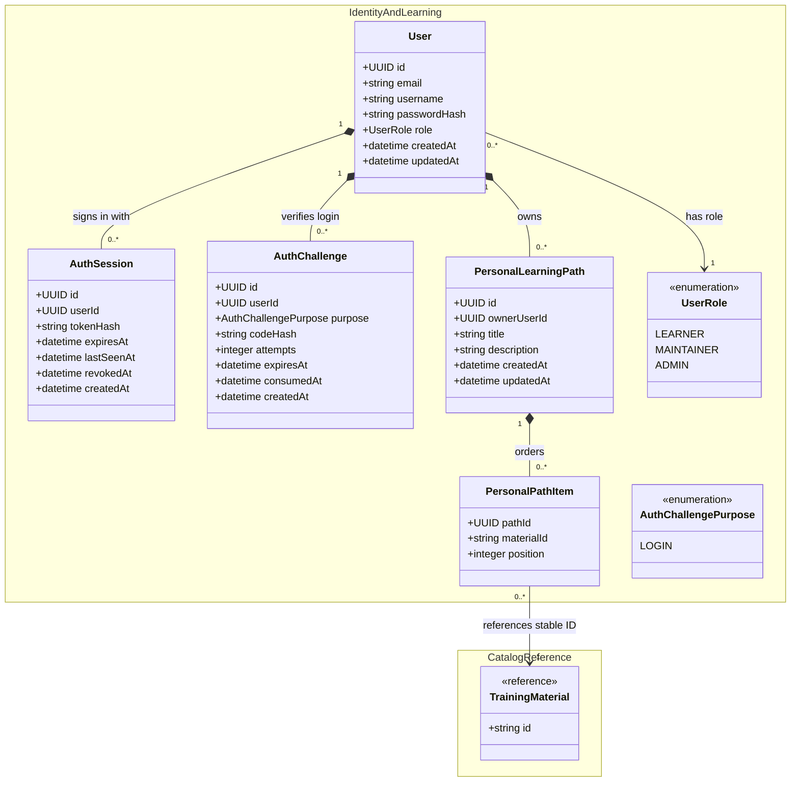

# Local Authentication and Authorization Design

This proposed V1 model replaces the current CILogon-specific identity path with
local email/username and password authentication. It retains one local role per
user and keeps public catalog access unauthenticated.

## Changes from the current class diagram

- Replace the required, CILogon-specific `AuthIdentity` with local credentials
  on `User`: email/username and a password hash. Passwords themselves are never
  stored.
- Add `AuthChallenge` for the short period between password validation and
  email-code verification. It is not a logged-in session.
- Add `AuthSession` after verification succeeds. Its hashed token, expiry, and
  revocation state allow logout and server-side session invalidation.
- Keep `UserRole` unchanged: each user has exactly one of `LEARNER`,
  `MAINTAINER`, or `ADMIN`. `ADMIN` changes roles; `MAINTAINER` is reserved for
  future content management; all authenticated roles can own personal paths.
- Retain `PersonalLearningPath` and `PersonalPathItem`, but make their
  owner-scoped relationship explicit for the new authenticated API.



## Authentication flow

1. `POST /auth/login` verifies the password and creates a short-lived
   `AuthChallenge`; the verification code is delivered to the user's email.
2. `POST /auth/verify-login` consumes the code and creates an `AuthSession`.
   The browser receives only the raw session token in a Secure, HttpOnly,
   SameSite cookie; the database stores its hash.
3. Every protected request resolves the cookie to a non-revoked, unexpired
   session, then derives the user and role server-side.

## API surface and roles

| Endpoint                             | Access        | Purpose                                                    |
| ------------------------------------ | ------------- | ---------------------------------------------------------- |
| `POST /auth/register`                | Public        | Create a `LEARNER` account.                                |
| `POST /auth/login`                   | Public        | Verify password and start email-code verification.         |
| `POST /auth/verify-login`            | Public        | Verify the code and establish a session.                   |
| `POST /auth/logout`                  | Authenticated | Revoke the current session.                                |
| `GET /auth/me`                       | Authenticated | Return the current account and role.                       |
| `PATCH /users/{userId}/role`         | `ADMIN`       | Assign `LEARNER`, `MAINTAINER`, or `ADMIN`.                |
| `DELETE /users/{userId}/role`        | `ADMIN`       | Demote the user to `LEARNER`; every user retains one role. |
| `GET /me/learning-paths`             | Authenticated | List the caller's personal learning paths.                 |
| `POST /me/learning-paths`            | Authenticated | Create a personal learning path.                           |
| `GET /me/learning-paths/{pathId}`    | Authenticated | Read one caller-owned personal learning path.              |
| `PATCH /me/learning-paths/{pathId}`  | Authenticated | Update one caller-owned personal learning path.            |
| `DELETE /me/learning-paths/{pathId}` | Authenticated | Delete one caller-owned personal learning path.            |

`MAINTAINER` is reserved for future content-management endpoints. It has no
V1 content-authoring endpoint. Bootstrap administrators should be provisioned
from development environment variables, never a source-controlled password.

## Authentication endpoint payloads

`POST /auth/register`

```json
{
  "email": "learner@example.org",
  "username": "learner",
  "password": "long passphrase here"
}
```

Returns `201 Created` with the new account's `id`, `email`, `username`, and
`role`. The server always assigns `LEARNER`.

`POST /auth/login`

```json
{ "emailOrUsername": "learner@example.org", "password": "long passphrase here" }
```

Returns `202 Accepted` with `challengeId` and `expiresAt` after creating an
email-code challenge. It does not create a session.

`POST /auth/verify-login`

```json
{ "challengeId": "6cb66713-88ce-4ad9-8d0f-43937ca96553", "code": "123456" }
```

Returns `204 No Content` and sets the Secure, HttpOnly session cookie. The raw
session token is never returned in JSON.

`POST /auth/logout` has no body. It returns `204 No Content`, revokes the
current session, and clears its cookie.

`GET /auth/me` has no body. It returns `200 OK` with the authenticated user's
`id`, `email`, `username`, and `role`.

`PATCH /users/{userId}/role`

```json
{ "role": "MAINTAINER" }
```

Requires an `ADMIN` session. Returns `200 OK` with the target user's `id`,
`email`, `username`, and updated `role`. An administrator cannot demote the
final active administrator.

`DELETE /users/{userId}/role` has no body and requires an `ADMIN` session. It
does not delete the user; it changes the target role to `LEARNER` and returns
`200 OK` with the updated account summary. The final active administrator
cannot be demoted.

`GET /me/learning-paths` has no body and returns `200 OK` with an array of the
caller's paths. Each path contains `id`, `title`, `description`, `createdAt`,
`updatedAt`, and ordered `items`.

`POST /me/learning-paths`

```json
{
  "title": "My GPU learning plan",
  "description": "Optional notes",
  "items": [
    { "materialId": "material-001", "position": 0 },
    { "materialId": "material-002", "position": 1 }
  ]
}
```

Returns `201 Created` with the complete path. The owner is derived from the
session; clients never submit `ownerUserId`.

`GET /me/learning-paths/{pathId}` has no body and returns `200 OK` with the
complete path only when it belongs to the current user. A missing or
non-owned path returns `404 Not Found`.

`PATCH /me/learning-paths/{pathId}` accepts any supplied combination of
`title`, `description`, and `items`. If `items` is included, it replaces the
full ordered item list in one transaction. It returns `200 OK` with the
updated complete path.

`DELETE /me/learning-paths/{pathId}` has no body and returns `204 No Content`.
It can delete only a path owned by the current user.

Malformed request bodies return `400 Bad Request`; missing/invalid session
cookies return `401 Unauthorized`; and attempts to use an admin-only role
endpoint without `ADMIN` return `403 Forbidden`.
