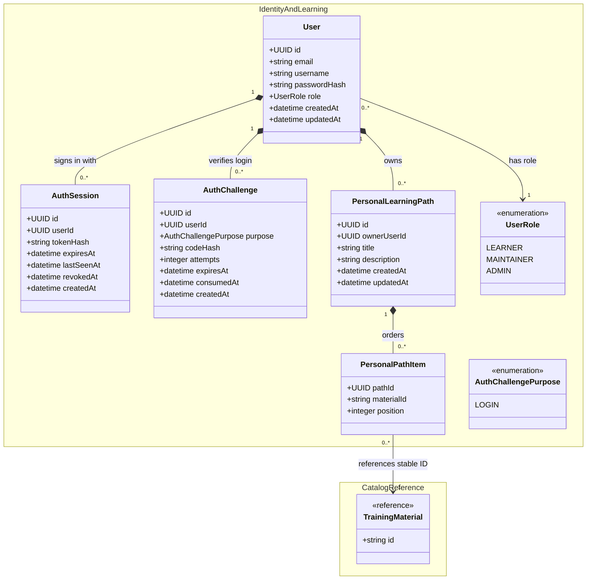

# Local Authentication and Authorization Design

This proposed V1 model replaces the current CILogon-specific identity path with
local email/username and password authentication. It retains one local role per
user and keeps public catalog access unauthenticated.

## Changes from the current class diagram

- Replace the required, CILogon-specific `AuthIdentity` with local credentials
  on `User`: email/username and a password hash. Passwords themselves are never
  stored.
- Add `AuthChallenge` for the short period between password validation and
  email-code verification. It is not a logged-in session.
- Add `AuthSession` after verification succeeds. Its hashed token, expiry, and
  revocation state allow logout and server-side session invalidation.
- Keep `UserRole` unchanged: each user has exactly one of `LEARNER`,
  `MAINTAINER`, or `ADMIN`. `ADMIN` changes roles; `MAINTAINER` is reserved for
  future content management; all authenticated roles can own personal paths.
- Retain `PersonalLearningPath` and `PersonalPathItem`, but make their
  owner-scoped relationship explicit for the new authenticated API.

## Authentication flow

1. `POST /auth/login` verifies the password and creates a short-lived
   `AuthChallenge`; the verification code is delivered to the user's email.
2. `POST /auth/verify-login` consumes the code and creates an `AuthSession`.
   The browser receives only the raw session token in a Secure, HttpOnly,
   SameSite cookie; the database stores its hash.
3. Every protected request resolves the cookie to a non-revoked, unexpired
   session, then derives the user and role server-side.

## API surface and roles

| Endpoint                                   | Access        | Purpose                                                    |
| ------------------------------------------ | ------------- | ---------------------------------------------------------- |
| `POST /auth/register`                      | Public        | Create a `LEARNER` account.                                |
| `POST /auth/login`                         | Public        | Verify password and start email-code verification.         |
| `POST /auth/verify-login`                  | Public        | Verify the code and establish a session.                   |
| `POST /auth/logout`                        | Authenticated | Revoke the current session.                                |
| `GET /auth/me`                             | Authenticated | Return the current account and role.                       |
| `PATCH /users/{userId}/role`               | `ADMIN`       | Assign `LEARNER`, `MAINTAINER`, or `ADMIN`.                |
| `DELETE /users/{userId}/role`              | `ADMIN`       | Demote the user to `LEARNER`; every user retains one role. |
| `GET/POST/PATCH/DELETE /me/learning-paths` | Authenticated | Read and manage only the caller's personal learning paths. |

`MAINTAINER` is reserved for future content-management endpoints. It has no
V1 content-authoring endpoint. Bootstrap administrators should be provisioned
from development environment variables, never a source-controlled password.
