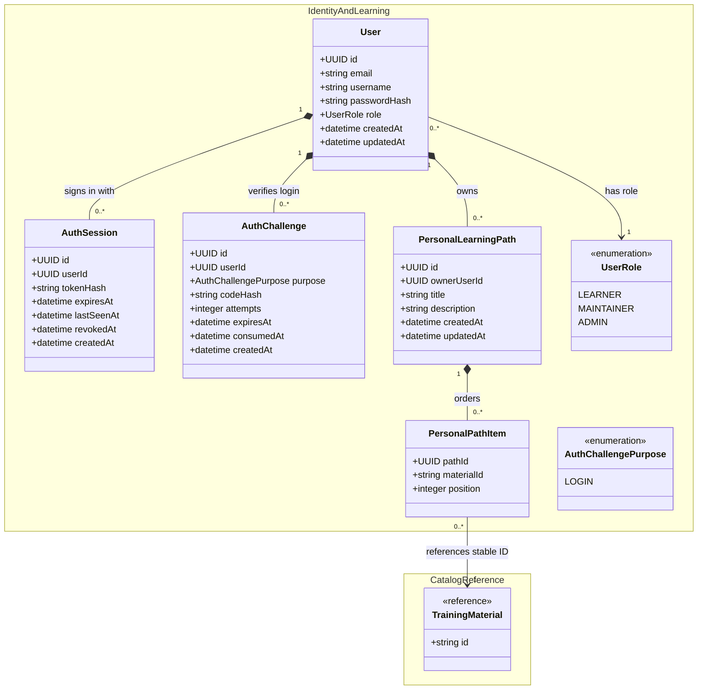

# Local Authentication and Authorization Design

The implemented V1 model uses local email/username and password authentication.
It retains one local role per user and keeps public catalog access unauthenticated.

## Identity and persistence model

- Store local credentials on `User`: email/username and a scrypt password hash.
  Passwords themselves are never stored.
- Use `AuthChallenge` for the short period between password validation and
  email-code verification. It is not a logged-in session.
- Create `AuthSession` after verification succeeds. Its hashed token, expiry, and
  revocation state allow logout and server-side session invalidation.
- Each user has exactly one `UserRole`: `LEARNER`, `MAINTAINER`, or `ADMIN`.
  `ADMIN` lists accounts and changes roles; `MAINTAINER` is reserved for
  future content management; all authenticated roles can own personal paths.
- `PersonalLearningPath` belongs to one user, and `PersonalPathItem` stores its
  ordered material references. All personal path operations are scoped to the
  session user, including requests made by administrators.



## Authentication flow

1. `POST /auth/login` verifies the password and creates a short-lived
   `AuthChallenge`; a six-digit verification code is sent to the user's email
   through SMTP. The challenge stores the code's SHA-256 hash and expires after
   ten minutes.
2. `POST /auth/verify-login` consumes the code and creates an `AuthSession`.
   The browser receives the raw session token in an HttpOnly, SameSite=Lax
   cookie; the database stores its SHA-256 hash. The session expires after
   24 hours.
3. Every protected request resolves the cookie to a non-revoked, unexpired
   session, then derives the user and role server-side.
4. Administrator routes run `SessionAuthGuard` followed by `AdminAuthGuard`.
   The first establishes the current identity; the second requires `ADMIN`.
   Roles are read from the database on each request, so a role change applies to
   existing sessions on their next request.
5. Logout awaits revocation of the current session, then clears its cookie with
   matching cookie settings. Other sessions belonging to the account remain valid.

Verification allows at most five incorrect attempts per challenge. Failed
attempts are committed before returning `401`. Successful verification locks
and consumes the challenge in the same transaction that creates the session;
an expired, exhausted, or consumed challenge cannot establish another session.

The development cookie is named `session` and permits local HTTP testing.
With `NODE_ENV=production`, the name is `__Host-session` and Secure is enabled.
Both use HttpOnly, SameSite=Lax, path `/`, and the session expiration. No Domain
attribute is set. The raw token is never returned in JSON.

## API surface and roles

All routes below use the `/api/v1` prefix. The table lists implemented endpoints.

| Endpoint                             | Access        | Purpose                                            |
| ------------------------------------ | ------------- | -------------------------------------------------- |
| `POST /users`                        | Public        | Create a `LEARNER` account.                        |
| `POST /auth/login`                   | Public        | Verify password and start email-code verification. |
| `POST /auth/verify-login`            | Public        | Verify the code and establish a session.           |
| `POST /auth/logout`                  | Authenticated | Revoke the current session.                        |
| `GET /me`                            | Authenticated | Return the current account and role.               |
| `GET /users`                         | `ADMIN`       | List account summaries without credentials.        |
| `PATCH /users/{userId}/role`         | `ADMIN`       | Assign `LEARNER`, `MAINTAINER`, or `ADMIN`.        |
| `GET /me/learning-paths`             | Authenticated | List the caller's personal learning paths.         |
| `POST /me/learning-paths`            | Authenticated | Create a personal learning path.                   |
| `GET /me/learning-paths/{pathId}`    | Authenticated | Read one caller-owned personal learning path.      |
| `PATCH /me/learning-paths/{pathId}`  | Authenticated | Update one caller-owned personal learning path.    |
| `DELETE /me/learning-paths/{pathId}` | Authenticated | Delete one caller-owned personal learning path.    |

`MAINTAINER` is reserved for future content-management endpoints. It has no
V1 content-authoring endpoint. Registration always creates `LEARNER` accounts;
clients cannot supply a role. Bootstrap administrators are provisioned using
the admin seed script and environment settings described below.

## Endpoint payloads

`POST /users`

```json
{
  "email": "learner@example.org",
  "username": "learner",
  "password": "long passphrase here"
}
```

Returns `201 Created` with the new account's `id`, `email`, `username`, and
`role`. The server always assigns `LEARNER`.

Email addresses are limited to 254 characters. Usernames contain 3–50 letters,
digits, or underscores, and passwords contain 15–128 characters. Email and
username identities are trimmed and normalized to lowercase; passwords are
preserved as supplied. A duplicate email or username returns `409 Conflict`.

`POST /auth/login`

```json
{ "emailOrUsername": "learner@example.org", "password": "long passphrase here" }
```

Returns `202 Accepted` with `challengeId` and `expiresAt` after creating an
email-code challenge. It does not create a session.
Invalid credentials return `401 Unauthorized`; SMTP delivery failure returns
`503 Service Unavailable`. Email is sent to the account's stored address even
when the caller signs in with a username.

`POST /auth/verify-login`

```json
{ "challengeId": "6cb66713-88ce-4ad9-8d0f-43937ca96553", "code": "123456" }
```

Returns `204 No Content` and sets the environment-appropriate session cookie.
The raw session token is never returned in JSON.

`POST /auth/logout` has no body. It returns `204 No Content`, revokes the
current session, and clears its cookie.
Missing, expired, or revoked sessions return `401`, including repeated logout
requests. Logout does not delete the session row.

`GET /me` has no body. It returns `200 OK` with the authenticated user's
`id`, `email`, `username`, and `role`.

`GET /users` has no body and requires an `ADMIN` session. It returns `200 OK`
with an array of account summaries containing `id`, `email`, `username`, and
`role`, in creation order. Password hashes and session data are not exposed.

`PATCH /users/{userId}/role`

```json
{ "role": "MAINTAINER" }
```

Requires an `ADMIN` session. Returns `200 OK` with the target user's `id`,
`email`, `username`, and updated `role`. An administrator cannot demote the
final administrator; that attempt returns `409 Conflict`. A missing target
returns `404 Not Found`, an invalid UUID or role returns `400 Bad Request`, and
setting the existing role succeeds without changing it. To demote a user,
send `{ "role": "LEARNER" }` to this same endpoint.

Role changes use a `READ COMMITTED` transaction and share a PostgreSQL transaction
advisory lock. The acting user's admin role is checked again after acquiring
the lock, and the target row is locked before changing it. The admin count is
checked inside the transaction before a demotion. Concurrent demotions therefore
cannot both pass a stale count, and an actor demoted while waiting for the lock
receives `403`. An administrator can change their own role if another admin
remains; their existing session reflects the new role on the next request.

`GET /me/learning-paths` has no body and returns `200 OK` with an array of the
caller's paths. Each path contains `id`, `title`, `description`, `createdAt`,
`updatedAt`, and ordered `items`.
The list is ordered by `updatedAt` descending, with `id` as the tie breaker.
It returns `[]` when the caller has no paths and includes paths with no items.
Each item contains `materialId` and `position`, ordered by ascending position.

`POST /me/learning-paths`

```json
{
  "title": "My GPU learning plan",
  "description": "Optional notes",
  "items": [
    { "materialId": "material-001", "position": 0 },
    { "materialId": "material-002", "position": 1 }
  ]
}
```

Returns `201 Created` with the complete path. The owner is derived from the
session; clients never submit `ownerUserId`.

Titles are trimmed, must be nonblank, and are limited to 200 characters.
Descriptions may be omitted or null and are limited to 5000 characters.
Items may be omitted or empty, with at most 1000 entries per path. Each entry
must be an object containing a nonblank `materialId` of at most 254 characters
and an integer `position` between zero and 2,147,483,647. Material IDs and
positions must each be unique within the path; gaps in positions are allowed.
Material IDs must exist, including when they belong to older catalog snapshots.
Creating the path and its items is one transaction.

`GET /me/learning-paths/{pathId}` has no body and returns `200 OK` with the
complete path only when it belongs to the current user. A missing or
non-owned path returns `404 Not Found`.

`PATCH /me/learning-paths/{pathId}` accepts any supplied combination of
`title`, `description`, and `items`. If `items` is included, it replaces the
full ordered item list in one transaction. It returns `200 OK` with the
updated complete path.

Omitted fields remain unchanged. `items: []` removes all items, and
`description: null` clears the description. An empty body, null title, or null
items value returns `400`. The same validation rules apply as on creation.
The owner-scoped path row is locked during the transaction, and material
references are validated before replacing items. A failed replacement leaves
the previous path and items intact. Item-only updates also refresh `updatedAt`.

`DELETE /me/learning-paths/{pathId}` has no body and returns `204 No Content`.
It can delete only a path owned by the current user.
Its items are deleted through the database cascade. A missing or non-owned path
returns `404`, including a repeated deletion. Invalid path UUIDs return `400`
for detail, update, and delete requests.

Malformed request bodies return `400 Bad Request`; missing/invalid session
cookies return `401 Unauthorized`; and attempts to use an admin-only role
endpoint without `ADMIN` return `403 Forbidden`.

Unexpected body fields are rejected, including client-supplied ownership or
role fields on public registration. API errors use `statusCode`, `error`,
`timestamp`, `message`, and `path`; validation messages may be arrays.

## Local setup and verification

Apply the database migrations before using these endpoints. When restoring the
committed catalog snapshot, restore it first and then run any newer migrations.

Local email testing uses a standalone Mailpit container because the current
Compose file defines only PostgreSQL. Follow the
[Mailpit startup instructions](../README.md#5-start-mailpit-for-local-email-testing)
and open [the local inbox](http://localhost:8025). The email service defaults to
`SMTP_HOST=localhost` and `SMTP_PORT=1025`; `AUTH_EMAIL_FROM` controls the sender.
The current implementation uses SMTP and does not read `RESEND_API_KEY`.

For the initial administrator, set `ADMIN_EMAIL`, `ADMIN_USERNAME`, and
`ADMIN_PASS` in `.env`, then run:

```bash
npx ts-node src/database/seed/seed-admin-account.ts
```

The seed requires a password of 15–128 characters, hashes it with scrypt, and
upserts the account by email. Rerunning it resets the password and assigns
`ADMIN`. Use the script directly; the current `seed:admin` npm command points
to the curated learning path seed.

`npm run test:api` starts the API and runs the Postman collection against a
populated test database. The runner creates two temporary learners, one admin,
and their sessions, then cleans up their accounts and dependent data even when
assertions fail. It does not require Mailpit or exercise the email login flow.
Postman covers personal path CRUD, ownership, validation, administrator access,
and role changes using existing sessions. Unit tests cover guard order, final-admin
protection, competing demotions, stale admin permissions, and awaited revocation.
GitHub Actions restores the catalog snapshot, applies migrations, and runs the
same collection. See [the README](../README.md#postman-api-tests) for commands
and Postman environment variables.
