# SDSC Learning Hub API Gateway Persistence Class Diagram

This diagram represents the entities persisted by the NestJS API Gateway in PostgreSQL. `ChunkEmbedding.embedding` is a `pgvector` column in that same database. S3 and the snapshot importer are external components, so this model records their provenance through `CatalogSnapshot` rather than treating them as database classes.

```mermaid
classDiagram
direction TB

namespace IdentityAndLearning {
  class User {
    +UUID id
    +string email
    +string displayName
    +UserRole role
    +datetime createdAt
    +datetime lastLoginAt
  }

  class AuthIdentity {
    +UUID id
    +UUID userId
    +string issuer
    +string subject
    +string identityProvider
  }

  class Bookmark {
    +UUID id
    +UUID userId
    +string materialId
    +datetime createdAt
  }

  class LearningProgress {
    +UUID id
    +UUID userId
    +string materialId
    +number progressPercent
    +datetime updatedAt
  }

  class PersonalLearningPath {
    +UUID id
    +UUID ownerUserId
    +string title
    +string description
    +datetime createdAt
  }

  class PersonalPathItem {
    +UUID id
    +UUID pathId
    +string materialId
    +integer position
  }

  class CuratedLearningPath {
    +string id
    +string title
    +string description
    +string audience
    +string prerequisites
    +string estimatedScope
  }

  class CuratedPathItem {
    +string pathId
    +string materialId
    +integer position
  }

  class UserRole {
    <<enumeration>>
    LEARNER
    MAINTAINER
    ADMIN
  }
}

namespace SnapshotCatalog {
  class CatalogSnapshot {
    +string snapshotId
    +string schemaVersion
    +string codeVersion
    +string configurationHash
    +datetime generatedAt
    +string bucketObjectKey
    +string objectSha256
    +datetime importedAt
  }

  class EventSeries {
    +string id
    +string snapshotId
    +string name
    +string reviewStatus
    +string source
  }

  class EventEdition {
    +string id
    +string snapshotId
    +string title
    +string description
    +datetime start
    +datetime end
    +string format
    +string location
    +string sourceEventId
  }

  class TrainingMaterial {
    +string id
    +string snapshotId
    +string title
    +string description
    +string sourceRepository
    +string sourceCommit
  }

  class ContentResource {
    +string id
    +string snapshotId
    +string title
    +ResourceType resourceType
    +string canonicalUrl
    +string originalUrl
    +string verificationStatus
    +string extractionStatus
    +string contentHash
    +string sourcePath
  }

  class Person {
    +string id
    +string snapshotId
    +string name
    +string source
  }

  class Topic {
    +string id
    +string snapshotId
    +string name
    +string description
    +string reviewStatus
    +string source
  }

  class Tool {
    +string id
    +string snapshotId
    +string name
    +string reviewStatus
    +string source
  }

  class System {
    +string id
    +string snapshotId
    +string name
    +string reviewStatus
    +string source
  }

  class CatalogAlias {
    +string snapshotId
    +string alias
    +string canonicalId
    +string entityType
    +string reviewStatus
    +string source
  }

  class CatalogRelationship {
    +string id
    +string snapshotId
    +RelationshipType type
    +string sourceId
    +string targetId
    +string evidence
    +string extractionMethod
    +string reviewStatus
    +string trustClass
    +string sourceDocument
  }

  class ResourceType {
    <<enumeration>>
    CATALOG_METADATA
    WEBPAGE
    REPOSITORY_SESSION
    TRANSCRIPT
    VIDEO
    SLIDES
    REPOSITORY
  }

  class RelationshipType {
    <<enumeration>>
    INSTANCE_OF
    HAS_MATERIAL
    HAS_RESOURCE
    COVERS_TOPIC
    TEACHES_TOOL
    TARGETS_SYSTEM
    TAUGHT_BY
  }
}

namespace AIDARetrieval {
  class ContentChunk {
    +string id
    +string snapshotId
    +string materialId
    +string contentResourceId
    +string eventEditionId
    +ChunkSourceKind sourceKind
    +integer chunkIndex
    +string section
    +text text
    +integer wordStart
    +integer wordEnd
    +string textHash
    +string sourceHash
    +string sourceEntityId
    +string sourceLocation
    +json provenance
    +string chunkingVersion
    +string language
  }

  class ChunkEmbedding {
    +UUID id
    +string chunkId
    +string model
    +integer dimensions
    +vector embedding
    +datetime createdAt
  }

  class ChunkSourceKind {
    <<enumeration>>
    TRANSCRIPT
    CATALOG_METADATA
    REPOSITORY_SESSION
    SLIDES
  }
}

User "1" *-- "1" AuthIdentity : authenticates with CILogon
User "0..*" --> "1" UserRole : has role
User "1" *-- "0..*" Bookmark : saves
User "1" *-- "0..*" LearningProgress : resumes
User "1" *-- "0..*" PersonalLearningPath : owns
PersonalLearningPath "1" *-- "1..*" PersonalPathItem : orders
CuratedLearningPath "1" *-- "1..*" CuratedPathItem : orders

Bookmark "0..*" --> "1" TrainingMaterial : references
LearningProgress "0..*" --> "1" TrainingMaterial : tracks
PersonalPathItem "0..*" --> "1" TrainingMaterial : references
CuratedPathItem "0..*" --> "1" TrainingMaterial : references

CatalogSnapshot "1" *-- "0..*" EventSeries : imports
CatalogSnapshot "1" *-- "1..*" EventEdition : imports
CatalogSnapshot "1" *-- "1..*" TrainingMaterial : imports
CatalogSnapshot "1" *-- "1..*" ContentResource : imports
CatalogSnapshot "1" *-- "0..*" Person : imports
CatalogSnapshot "1" *-- "0..*" Topic : imports
CatalogSnapshot "1" *-- "0..*" Tool : imports
CatalogSnapshot "1" *-- "0..*" System : imports
CatalogSnapshot "1" *-- "0..*" CatalogAlias : imports
CatalogSnapshot "1" *-- "1..*" CatalogRelationship : imports

EventEdition "0..*" --> "0..1" EventSeries : INSTANCE_OF
EventEdition "0..1" --> "1..*" TrainingMaterial : HAS_MATERIAL
TrainingMaterial "0..*" --> "1..*" ContentResource : HAS_RESOURCE
TrainingMaterial "0..*" --> "0..*" Topic : COVERS_TOPIC
TrainingMaterial "0..*" --> "0..*" Tool : TEACHES_TOOL
TrainingMaterial "0..*" --> "0..*" System : TARGETS_SYSTEM
TrainingMaterial "0..*" --> "0..*" Person : TAUGHT_BY

CatalogAlias ..> EventSeries : may name
CatalogAlias ..> Topic : may name
CatalogAlias ..> Tool : may name
CatalogAlias ..> System : may name
CatalogRelationship ..> RelationshipType
ContentResource ..> ResourceType

CatalogSnapshot "1" *-- "0..*" ContentChunk : imports
ContentChunk "0..*" --> "1" TrainingMaterial : grounds answer
ContentChunk "0..*" --> "1" ContentResource : cites
ContentChunk "0..*" --> "0..1" EventEdition : event context
ContentChunk ..> ChunkSourceKind
ContentChunk "1" *-- "0..*" ChunkEmbedding : indexed by model
```

## Why the model is divided into sections

- **Identity and learner data** is mutable application state owned by the Learning Hub.
- **Snapshot catalog data** is imported, versioned content owned by the data pipeline.
- **AIDA retrieval data** is a derived search index that can be rebuilt from a snapshot.

The sections share one PostgreSQL database for the MVP. The separation identifies different ownership and lifecycle rules; it does not imply three databases or prevent foreign-key relationships between them.

## Deliberately outside this persistence diagram

- React/Next.js components and NestJS controllers, services, guards, and modules
- S3 bucket, snapshot importer, GitHub Actions, and deployment infrastructure
- CILogon OAuth/OIDC request sequence and tokens
- Training material submission, drafts, moderation, and publication workflow
- Shared or group learning paths and path visibility
- Neo4j and GraphRAG research paths
- AIDA conversation history until ownership, deletion, and retention are defined
