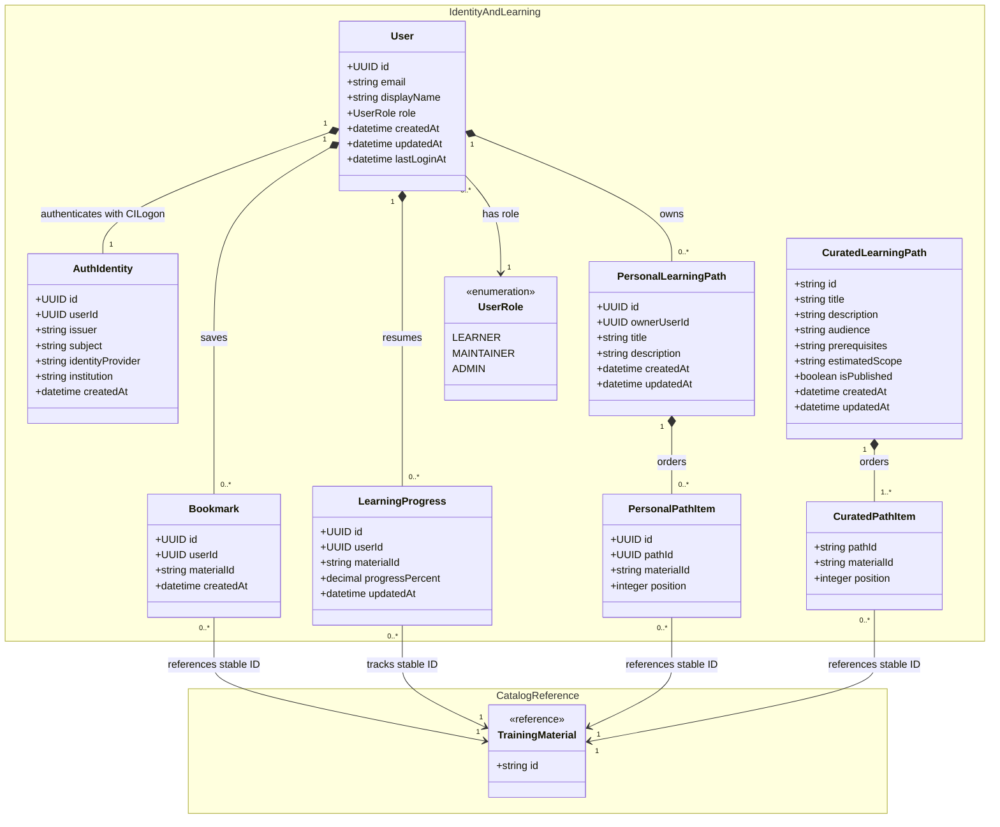
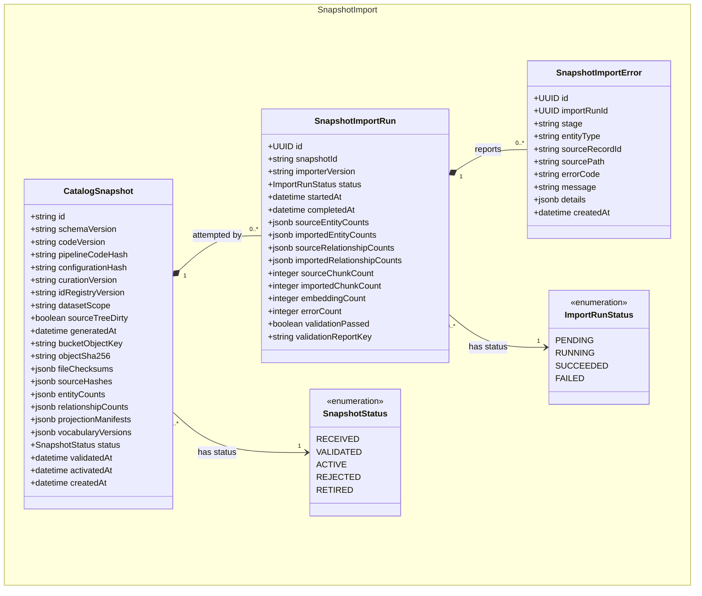
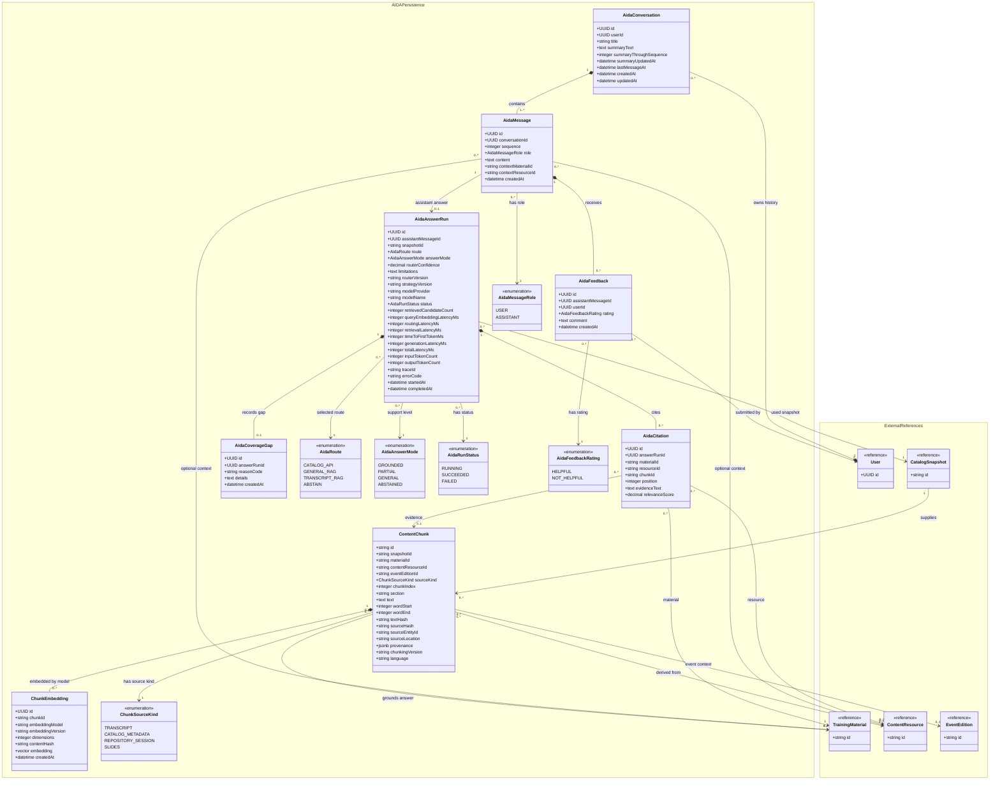

# SDSC Learning Hub API Gateway Persistence Class Diagram

This is the authoritative persistence/domain model for the Learning Hub API Gateway MVP. All four logical namespaces below coexist in **one PostgreSQL database**; `ChunkEmbedding.embedding` uses the `pgvector` extension in that database. Snapshot archives remain immutable in S3, while the importer builds the relational catalog and retrieval index used by the API.

`Snapshot v3` identifies a schema family, not one unique dataset. The reviewed initial fixture is `snapshot-v3-20260805T002229Z`, archive SHA-256 `82B16349C93B88AD31FA8D08D76B2BA2A470C0E327151A6BD695B51967CC6945`. It provides 530 materials, 1,423 resources, 520 event editions, 6 event series, 49 people, 21 topics, 36 tools, 5 systems, and 2,291 content chunks. It does not contain generated embeddings; the importer creates those after loading and validating the supplied chunks. Every later import or comparison must identify its exact snapshot ID and checksum rather than saying only "Snapshot v3."

## 1. Identity and learner continuity

## 2. Snapshot import and activation

## 3. Snapshot v3 catalog projection

```mermaid
classDiagram
direction LR

namespace SnapshotCatalog {
  class EventSeries {
    +string id
    +string snapshotId
    +string name
    +string reviewStatus
    +string source
  }

  class EventEdition {
    +string id
    +string snapshotId
    +string title
    +string description
    +datetime startAt
    +datetime endAt
    +string format
    +string location
    +string sourceEventId
    +string sourceDateText
    +string sourceTimeText
    +string sourceFile
  }

  class TrainingMaterial {
    +string id
    +string snapshotId
    +string title
    +string description
    +string sourceRepository
    +string sourceCommit
    +string groupingMethod
    +string groupingNote
  }

  class ContentResource {
    +string id
    +string snapshotId
    +ResourceType resourceType
    +string title
    +string canonicalUrl
    +string originalUrl
    +string source
    +string sourceDocument
    +string status
    +string verificationStatus
    +string extractionStatus
    +string contentHash
    +string sessionKey
    +string textSelectionPolicy
    +integer sourceFileCount
    +integer indexedFileCount
    +integer excludedFileCount
    +jsonb excludedByReason
    +boolean requiresOcr
  }

  class ContentResourceFile {
    +string resourceId
    +string path
    +string contentHash
    +integer position
  }

  class Person {
    +string id
    +string snapshotId
    +string name
    +string source
  }

  class Topic {
    +string id
    +string snapshotId
    +string name
    +string description
    +string reviewStatus
    +string source
  }

  class Tool {
    +string id
    +string snapshotId
    +string name
    +string reviewStatus
    +string source
  }

  class System {
    +string id
    +string snapshotId
    +string name
    +string reviewStatus
    +string source
  }

  class EventSeriesAlias {
    +string eventSeriesId
    +string alias
    +string reviewStatus
    +string source
  }

  class TopicAlias {
    +string topicId
    +string alias
    +string reviewStatus
    +string source
  }

  class ToolAlias {
    +string toolId
    +string alias
    +string reviewStatus
    +string source
  }

  class SystemAlias {
    +string systemId
    +string alias
    +string reviewStatus
    +string source
  }

  class EventSeriesEdition {
    +string relationshipId
    +string snapshotId
    +string eventSeriesId
    +string eventEditionId
    +string evidence
    +string extractionMethod
    +string reviewStatus
    +string trustClass
    +string sourceDocument
  }

  class EventMaterial {
    +string relationshipId
    +string snapshotId
    +string eventEditionId
    +string materialId
    +string evidence
    +string extractionMethod
    +string reviewStatus
    +string trustClass
    +string sourceDocument
  }

  class MaterialResource {
    +string relationshipId
    +string snapshotId
    +string materialId
    +string resourceId
    +string evidence
    +string extractionMethod
    +string reviewStatus
    +string trustClass
    +string sourceDocument
  }

  class MaterialTopic {
    +string relationshipId
    +string snapshotId
    +string materialId
    +string topicId
    +string evidence
    +string extractionMethod
    +string reviewStatus
    +string trustClass
    +string sourceDocument
  }

  class MaterialTool {
    +string relationshipId
    +string snapshotId
    +string materialId
    +string toolId
    +string evidence
    +string extractionMethod
    +string reviewStatus
    +string trustClass
    +string sourceDocument
  }

  class MaterialSystem {
    +string relationshipId
    +string snapshotId
    +string materialId
    +string systemId
    +string evidence
    +string extractionMethod
    +string reviewStatus
    +string trustClass
    +string sourceDocument
  }

  class MaterialInstructor {
    +string relationshipId
    +string snapshotId
    +string materialId
    +string personId
    +string evidence
    +string extractionMethod
    +string reviewStatus
    +string trustClass
    +string sourceDocument
  }

  class ResourceType {
    <<enumeration>>
    CATALOG_METADATA
    REPOSITORY
    REPOSITORY_SESSION
    SLIDES
    TRANSCRIPT
    VIDEO
    WEBPAGE
  }
}

namespace ImportReference {
  class CatalogSnapshot {
    <<reference>>
    +string id
  }
}

CatalogSnapshot "1" --> "0..*" EventSeries : supplies
CatalogSnapshot "1" --> "0..*" EventEdition : supplies
CatalogSnapshot "1" --> "0..*" TrainingMaterial : supplies
CatalogSnapshot "1" --> "0..*" ContentResource : supplies
CatalogSnapshot "1" --> "0..*" Person : supplies
CatalogSnapshot "1" --> "0..*" Topic : supplies
CatalogSnapshot "1" --> "0..*" Tool : supplies
CatalogSnapshot "1" --> "0..*" System : supplies

EventSeries "1" *-- "0..*" EventSeriesAlias : recognized by
Topic "1" *-- "0..*" TopicAlias : recognized by
Tool "1" *-- "0..*" ToolAlias : recognized by
System "1" *-- "0..*" SystemAlias : recognized by

EventSeries "1" <-- "0..*" EventSeriesEdition : series
EventEdition "1" <-- "0..1" EventSeriesEdition : edition
EventEdition "1" <-- "0..*" EventMaterial : event
TrainingMaterial "1" <-- "0..*" EventMaterial : material
TrainingMaterial "1" <-- "0..*" MaterialResource : material
ContentResource "1" <-- "0..*" MaterialResource : resource
TrainingMaterial "1" <-- "0..*" MaterialTopic : material
Topic "1" <-- "0..*" MaterialTopic : topic
TrainingMaterial "1" <-- "0..*" MaterialTool : material
Tool "1" <-- "0..*" MaterialTool : tool
TrainingMaterial "1" <-- "0..*" MaterialSystem : material
System "1" <-- "0..*" MaterialSystem : system
TrainingMaterial "1" <-- "0..*" MaterialInstructor : material
Person "1" <-- "0..*" MaterialInstructor : instructor
ContentResource "1" *-- "0..*" ContentResourceFile : selected files

ContentResource "0..*" --> "1" ResourceType : has type
```

## 4. AIDA retrieval and conversation persistence

## Implementation notes and scope decisions

### One database, four logical namespaces

- `IdentityAndLearning`, `SnapshotImport`, `SnapshotCatalog`, and `AIDAPersistence` are logical ownership boundaries, not separate databases.
- PostgreSQL stores every table in this diagram. `pgvector` adds the vector column and similarity index used by `ChunkEmbedding`.
- S3 is the immutable source/archive. The web application and normal catalog API query PostgreSQL, not S3.

### Snapshot import and activation

- `CatalogSnapshot.id` is the immutable manifest `snapshot_id`; `bucketObjectKey` and `objectSha256` identify the exact archive. The schema version alone never identifies an import.
- An import run downloads the archive, verifies its SHA-256 manifest, validates record counts and foreign keys, loads catalog/chunk rows, generates embeddings, and records individual failures.
- Catalog tables are the active product-serving projection. Import into staging tables first, then activate the validated projection transactionally. Preserve older bundles in S3 and their `CatalogSnapshot`/run history in PostgreSQL.
- Permit only one `CatalogSnapshot` with `status = ACTIVE` using a partial unique index.
- Snapshot v3 supplies chunks but declares `embedding_model = not-generated`; the importer must create `ChunkEmbedding` rows before AIDA RAG is considered ready.

### Relational catalog

- The serving model uses explicit join tables for every supported Snapshot v3 relationship. There is no polymorphic `CatalogRelationship` table in the active catalog.
- Each join table preserves Snapshot v3's relationship ID, evidence, extraction method, review status, trust class, and source document.
- Snapshot aliases are split by target type so every alias has a real foreign key. This avoids an unchecked `(entityType, canonicalId)` pair.
- The importer flattens Snapshot v3's nested source fields deliberately: material repository/commit metadata maps to `sourceRepository`/`sourceCommit`; event source values map to the explicit date, time, event ID, and source-file columns; resource `file_paths` and `file_hashes` map to `ContentResourceFile`; relationship provenance maps to the explicit evidence columns. The immutable S3 bundle remains the record for source fields not needed by the serving model.
- `ContentResourceFile` maps selected repository file paths and hashes. Large source text remains in the immutable snapshot; searchable text is stored as `ContentChunk` rows.
- The serving model does not invent material publication, freshness, or availability fields that the reviewed fixture cannot supply. Event dates and resource verification/status remain explicit and independently queryable.

### Learner and AIDA records

- New users receive one `UserRole`, defaulting to `LEARNER`. `MAINTAINER` and `ADMIN` are assigned by an authorized administrator, not by CILogon claims or self-registration.
- Public catalog browsing and public AIDA remain account-free. Anonymous AIDA interactions are transient; only authenticated users receive persisted conversation history.
- Persist only user/assistant message content, optional canonical UI context, route and support-mode metadata, citations, feedback, coverage gaps, and the rolling conversation summary. Do not store assembled system prompts, developer prompts, retrieved-context prompts, credentials, or provider secrets.
- `AidaRoute` records how evidence was selected. `AidaAnswerMode` independently records whether the final answer was grounded, partial, general, or abstained. Retrieval may force an abstention after an initially valid route when evidence is weak or uncitable.
- A citation always identifies a canonical training material. It may additionally identify a resource and content chunk. Abstentions may have no citations.
- `modelProvider`, `modelName`, and generation/token metrics are nullable for deterministic catalog answers and abstentions; citation `resourceId` and `chunkId` are also nullable.
- User-managed conversation deletion should hard-delete the conversation and cascade to messages, answer runs, citations, coverage gaps, and feedback, subject to the adopted audit/retention policy.

### Required constraints and indexes

- Unique: normalized `User.email`; `AuthIdentity.userId`; `(AuthIdentity.issuer, AuthIdentity.subject)`; `(Bookmark.userId, Bookmark.materialId)`; `(LearningProgress.userId, LearningProgress.materialId)`.
- Unique: `(PersonalPathItem.pathId, PersonalPathItem.position)` and `(PersonalPathItem.pathId, PersonalPathItem.materialId)`; equivalent constraints for curated path items.
- Unique: `CatalogSnapshot.id` and `CatalogSnapshot.bucketObjectKey`; every canonical catalog `id`; every relationship `relationshipId`; every join's FK pair; each alias normalized within its target table.
- Unique: `EventSeriesEdition.eventEditionId`, because Snapshot v3 allows an event edition to belong to at most one series.
- Unique: `(ContentResourceFile.resourceId, ContentResourceFile.path)`; `(ContentChunk.contentResourceId, ContentChunk.chunkIndex, ContentChunk.chunkingVersion, ContentChunk.textHash)`; `(ChunkEmbedding.chunkId, ChunkEmbedding.embeddingModel, ChunkEmbedding.embeddingVersion)`.
- Unique: `(AidaMessage.conversationId, AidaMessage.sequence)`; one `AidaAnswerRun` per assistant message; one `AidaCoverageGap` per answer run; `(AidaFeedback.assistantMessageId, AidaFeedback.userId)`.
- Check: `LearningProgress.progressPercent` is between 0 and 100; path, message, and citation positions are non-negative; `ContentChunk.wordStart <= wordEnd`; embedding dimensions match the configured model.
- Check: an `AidaAnswerRun` belongs only to an `ASSISTANT` message; a feedback user must own the message's conversation; optional message context IDs resolve to canonical catalog rows; `CatalogSnapshot.activatedAt` is present only for an active or retired snapshot.
- Search indexes: PostgreSQL full-text indexes over material/event titles and descriptions; normalized-name indexes for people/topics/tools/systems and aliases; B-tree indexes on every join FK and `snapshotId`.
- Catalog filter indexes: event `startAt`; resource `resourceType`/`status`; relationship target IDs used by topic, tool, system, instructor, event, and resource filters.
- Retrieval indexes: B-tree index on `ContentChunk.sourceKind`; full-text index on chunk text; pgvector HNSW or IVFFlat index compatible with the chosen distance operator.
- History indexes: `(AidaConversation.userId, AidaConversation.updatedAt)` and `(AidaMessage.conversationId, AidaMessage.sequence)`.
- Delete behavior: cascade user-owned records from `User`; cascade embeddings from chunks and citations/runs/messages/coverage gaps/feedback from conversations; cascade imported join rows from catalog entities. Restrict deletion of catalog entities referenced by bookmarks, progress, path items, or AIDA history; preserve stable-ID records rather than silently breaking user references.

### Deferred from this model

- Material submission, draft moderation, and publication workflows
- Shared/social learning paths and path visibility
- Neo4j and GraphRAG persistence
- NestJS controllers, services, guards, modules, S3 clients, and deployment components
- Transcript timestamp columns until the snapshot preserves `start_seconds` and `end_seconds`
