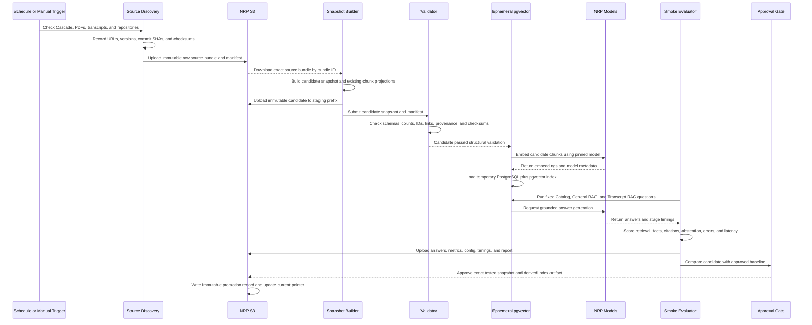

# Young's Data Ingestion and RAG Automation Review

**Review date:** 2026-09-02  
**Repository:** `sdsc-hpc-training-dev/intvid-backend`  
**Scope:** Read-only review of code, pull requests, completed GitHub Actions runs, and retained result artifacts. No workflow was triggered.

## Executive Verdict

Young has built two generations of automation. The current implementation is the open AIDA MVP V2 evaluation work in PR [#69](https://github.com/sdsc-hpc-training-dev/intvid-backend/pull/69), not the older five-strategy GraphRAG workflow.

The current V2 workflow does the following correctly:

- Downloads a frozen raw-data bundle from NRP S3 and verifies it.
- Clones ten Summer Institute repositories at pinned commit SHAs.
- Rebuilds a Snapshot v3-compatible candidate and validates it.
- Creates a fixed 28-material smoke corpus.
- Runs the four accepted MVP behaviors: Catalog/API, General RAG, Transcript RAG, and Honest Abstention.
- Uses `source_kind == "transcript"` for Transcript RAG and excludes transcript chunks from General RAG.
- Separates runtime questions from gold answers.
- Stores candidate snapshots, raw answers, metrics, reports, provenance, and checksums in immutable NRP paths.

However, several assumptions should be corrected:

1. **There is no ephemeral vector database.** General and transcript embeddings are held in Python lists, and retrieval is brute-force cosine similarity. The catalog uses temporary SQLite.
2. **The workflow rebuilds the candidate chunks.** It does not download an already-built Snapshot v3 ZIP and reuse its chunks. The snapshot builder creates `aida/chunks.jsonl` with 1,200-token chunks and 100-token overlap. Retrieval then consumes those chunks without chunking them again.
3. **The current run is report-only.** Its result is `FAIL` because of unsupported claims, but quality failure does not block the PR until a baseline is approved.
4. **The current workflow does not promote a snapshot.** It uploads immutable candidates only. That is a good safety property, but a separate approval and promotion step is still required.
5. **The latency evidence is not apples-to-apples with Mio's number.** The repository does not contain Mio's exact request, timing boundary, corpus, prompt, or result artifact.

The most useful next change is not higher concurrency. It is stage-level timing plus one shared comparison configuration that Mio and Young can run unchanged.

## Evidence Reviewed

- PR [#66](https://github.com/sdsc-hpc-training-dev/intvid-backend/pull/66): merged Snapshot v3 quality gates.
- PR [#69](https://github.com/sdsc-hpc-training-dev/intvid-backend/pull/69): open AIDA MVP V2 evaluation pipeline.
- Successful V2 smoke run [33044987612](https://github.com/sdsc-hpc-training-dev/intvid-backend/actions/runs/33044987612).
- Successful older quick run [33012300231](https://github.com/sdsc-hpc-training-dev/intvid-backend/actions/runs/33012300231).
- Older manual five-strategy run [32906364888](https://github.com/sdsc-hpc-training-dev/intvid-backend/actions/runs/32906364888).
- Retained result artifacts from all three runs.
- `processing/clone_summer_institute_repos.py`, `automated_sync.py`, snapshot processing code, quality workflow code, strategy implementations, scoring code, and frozen configuration.

The generation and build artifacts from these runs have expired, but each retained results artifact includes raw strategy results, scored results, metrics, configuration identity, snapshot validation, and immutable NRP object paths. No secret values were read or recorded.

## Current V2 Workflow, Exactly

### Job 1: Build and validate candidate

The workflow:

1. Checks out the PR merge commit.
2. Installs Python and pipeline/evaluation dependencies.
3. Validates the protected 120-question V2 benchmark and its checksums.
4. Creates an immutable run identity from Git SHA, run ID, timestamp, and label.
5. Downloads these frozen objects from `raw/source-bundle-20260805-v1` in NRP S3:
   - `manifest.json`
   - `SHA256SUMS.txt`
   - `raw.zip`
   - `transcripts.zip`
   - `pdfs.zip`
   - `pdf_text.zip`
6. Verifies archive checksums and extracts the bundle safely.
7. Clones ten Summer Institute repositories from 2016 through 2025 at commits pinned in `repos-lock.json`.
8. Recreates the event, transcript, PDF, PDF-text, and repository input reports.
9. Runs `processing/catalog_snapshot.py` with `chunk_tokens=1200` and `chunk_overlap=100`.
10. Validates required files, checksums, canonical IDs, relationship endpoints, URLs, data-quality status, and projection reconciliation.
11. Selects the fixed 28-material mini corpus for smoke evaluation.
12. Uploads the candidate and mini corpus as a short-lived GitHub artifact.

In run 33044987612, this job took about **5 minutes 23 seconds**. Candidate construction itself took about **4 minutes 37 seconds**.

### Job 2: Run four retrieval strategies

The workflow removes gold answers, human review data, and `.git` before generation. It then runs six fixed smoke questions per strategy:

| Strategy          | Implementation                                                                                        | NRP used at answer time | Smoke questions |
| ----------------- | ----------------------------------------------------------------------------------------------------- | ----------------------: | --------------: |
| Catalog/API       | Temporary SQLite catalog plus deterministic token matching                                            |                      No |               6 |
| General RAG       | Non-transcript candidate chunks, NRP embeddings, in-memory cosine search, NRP completion              |                     Yes |               6 |
| Transcript RAG    | Only `source_kind=transcript`, deterministic recording scope, in-memory cosine search, NRP completion |                     Yes |               6 |
| Honest Abstention | Fixed closed-corpus refusal                                                                           |                      No |               6 |

General RAG and Transcript RAG build separate in-memory indexes. Questions run serially. There is no request concurrency in this V2 implementation.

In run 33044987612:

- General index: 40 chunks, **3.05 seconds**.
- Transcript index: 230 chunks, **26.09 seconds**.
- All four strategies: about **10 minutes 16 seconds**.

### Job 3: Score, publish, and report

The scoring job:

1. Trains a TF-IDF plus logistic-regression router on 60 development questions.
2. Evaluates the router on 20 validation questions.
3. Scores deterministic retrieval, IDs, resources, links, citations, and abstention behavior.
4. Calls the NRP completion model again as a structured judge for every non-abstention answer.
5. Creates metrics, raw/scored results, a manifest, summary, and checksums.
6. Uploads the candidate snapshot and result package to immutable NRP prefixes.
7. Verifies uploaded files by downloading selected objects and checking hashes.

In run 33044987612:

- Router evaluation: about **2 seconds**.
- NRP-assisted answer scoring: about **22 minutes 6 seconds**.
- S3 upload and verification: about **3 minutes 34 seconds**.
- Total recorded workflow processing: **2,298 seconds**, or about **38 minutes 18 seconds**.

The judge is currently the largest part of the smoke workflow. It is evaluation cost, not user-facing AIDA latency.

## Frozen Parameters Found in Code

| Parameter                 | Current V2 value                                                                     |
| ------------------------- | ------------------------------------------------------------------------------------ |
| NRP endpoint              | `https://ellm.nrp-nautilus.io/v1` in completed run logs                              |
| Embedding model alias     | `qwen3-embedding`                                                                    |
| Completion model alias    | `gpt-oss`                                                                            |
| Chunk size                | 1,200 tokens                                                                         |
| Chunk overlap             | 100 tokens                                                                           |
| Retrieval top-k           | 5 chunks                                                                             |
| Embedding batch size      | 64 texts                                                                             |
| Generation temperature    | 0                                                                                    |
| Completion maximum tokens | 1,400 initially; provider may retry empty content with at least 2,000                |
| HTTP embedding timeout    | 300 seconds                                                                          |
| HTTP completion timeout   | 600 seconds                                                                          |
| Maximum provider retries  | 6, with exponential backoff                                                          |
| Vector store              | None; Python lists plus brute-force cosine similarity                                |
| Catalog store             | Temporary SQLite                                                                     |
| Runtime                   | GitHub-hosted `ubuntu-latest`, Python 3.11                                           |
| Request concurrency       | None in V2; questions and strategies execute serially                                |
| Cache behavior            | A shared secret `cache_salt` is sent, but cache hit/miss is not returned or reported |

The provider captures request elapsed time and token usage internally, but the strategy layer discards both. Therefore the artifacts cannot separate query embedding, local retrieval, completion generation, queue delay, or token throughput.

## Snapshot and Chunking Finding

The phrase "Snapshot v3" is being used for a **schema/product version**, not one immutable data artifact.

The V2 run rebuilt this candidate:

- 517 materials
- 1,409 content resources
- 2,199 chunks

The previously reviewed `snapshot-v3 (2).zip` had different counts: 530 materials, 1,423 resources, and 2,291 chunks. Both may be Snapshot v3-compatible, but they are not the same snapshot.

Every comparison must therefore record and enforce:

- snapshot ID;
- `snapshot.json` SHA-256;
- source-bundle ID and archive checksums;
- repository commit lock;
- pipeline commit SHA;
- chunking version, size, and overlap.

Without those values, "we both used Snapshot v3" is not sufficient for comparison.

## The 40 Seconds Versus 3 Seconds Question

### What the evidence shows

The repository itself reproduces both regimes:

| Run                     | Strategy          | Questions |     p50 |   p95/range |
| ----------------------- | ----------------- | --------: | ------: | ----------: |
| 32906364888, 2026-08-25 | older Vector RAG  |         4 |  3.51 s | 2.41-7.97 s |
| 33012300231, 2026-08-26 | older Vector RAG  |         4 | 20.57 s | p95 32.85 s |
| 33044987612, 2026-08-27 | V2 General RAG    |         6 | 49.21 s | p95 75.27 s |
| 33044987612, 2026-08-27 | V2 Transcript RAG |         6 | 42.29 s | p95 58.23 s |

All reported RAG question latencies are measured after corpus embeddings are built. They include:

1. one NRP query-embedding request;
2. local brute-force cosine retrieval;
3. one non-streaming NRP completion request through receipt of the complete answer.

They do not include dependency installation, S3 downloads, candidate snapshot construction, or corpus-index construction.

No retries were reported in these result artifacts. The endpoint and model aliases were the same in the inspected runs. GitHub runner setup therefore cannot explain the difference in the per-question number.

The V2 contexts are sometimes large. The six General RAG prompts carried roughly 5,800 to 30,000 evidence characters, and Transcript RAG prompts carried roughly 26,000 to 32,500 evidence characters. Larger prompts can increase model time, but they do not explain every observation: one older 22,000-character context completed in about eight seconds, while a newer 5,800-character context took about 59 seconds.

### What is likely but not yet proven

The strongest remaining hypotheses are:

- NRP queue/load or model cold-start variation between run times.
- Different prompt and output lengths.
- Different question/corpus behavior between the V1 and V2 benchmarks.
- Server-side caching or warm-state differences that are not surfaced in responses.
- Mio measuring time to first token while Young measures the complete non-streaming answer.
- Mio excluding query embedding or answer generation from the three-second number.
- Mio using a different deployed model behind an alias, endpoint, corpus, or precomputed index.

Rebuilding an index per question is **not** the cause in Young's implementation. Each strategy builds its index once, outside the question loop. Local cosine search over 40 or 230 chunks is also too small to plausibly explain tens of seconds.

The present evidence cannot identify query embedding versus completion generation as the dominant NRP stage because those timings are discarded.

## Required Apples-to-Apples Experiment

Mio and Young should run the same checked-in comparison command or container, not recreate one another's settings manually.

### Shared configuration

Pin all of the following in one file:

- exact snapshot SHA-256 and mini-corpus checksum;
- six fixed General RAG and six fixed Transcript RAG questions;
- exact chunk IDs and text used by retrieval;
- `qwen3-embedding` and `gpt-oss`, while also recording model IDs returned by NRP;
- chunking version, 1,200/100 settings, top-k 5, and embedding batch 64;
- exact system/user prompt templates;
- temperature 0 and maximum output tokens;
- serial execution with concurrency 1;
- a unique cache policy agreed in advance: explicitly cold or explicitly warmed;
- one warm-up request excluded from metrics, followed by at least five measured repetitions.

### Required timing fields per question

```text
query_embedding_ms
local_retrieval_ms
completion_time_to_first_token_ms
completion_total_ms
end_to_end_ms
prompt_tokens
completion_tokens
embedding_retries
completion_retries
http_status
returned_model_id
cache_status_if_available
```

Run it in this order:

1. Young on his laptop.
2. Mio on her laptop.
3. GitHub Actions using the exact same commit and input artifact.
4. Repeat the three runs close together in time.

Compare stage-level p50 and p95. Only after the serial baseline is understood should the team test concurrency 2, 4, and 8 as a throughput experiment. Concurrency may shorten the whole benchmark, but it does not automatically reduce one user's answer latency and may increase queueing at NRP.

## Metric Review

### Metrics already present

- Material recall at 5.
- Resource recall at 5.
- Transcript chunk recall at 5.
- Exact material/resource lists and counts.
- Canonical link precision.
- Citation precision and recall.
- Fabricated IDs and URLs.
- Required-fact coverage, groundedness, completeness, and unsupported claims through an NRP judge.
- Abstention metrics.
- p50 and p95 combined question latency.
- Provider retry totals.
- Router accuracy, macro F1, per-route metrics, and confusion matrix.

### Important gaps or interpretation risks

1. **No stage timings:** combined latency cannot locate the bottleneck.
2. **No token usage in reports:** cost and tokens-per-second cannot be compared.
3. **No first-token measurement:** interactive UX cannot be compared with non-streaming total time.
4. **No cache evidence:** cache effects cannot be separated from provider performance.
5. **Only six samples per route:** p95 is useful as a smoke signal but statistically fragile.
6. **The judge dominates runtime:** use deterministic metrics for PR blocking; run the expensive judge nightly/manual or judge only changed/failing answers.
7. **Direct-strategy success is not routed-app success:** Honest Abstention scored perfectly when assigned directly, but the learned router had 0 precision/recall/F1 for abstention on validation.
8. **Router quality is not ready:** overall validation accuracy was 0.55 and macro F1 was 0.532. It must remain report-only.
9. **Quality currently failed:** the V2 smoke run found 11 unsupported claims across generated answers, including a 0.667 unsupported-answer rate for General RAG.
10. **Catalog output needs refinement:** exact material list accuracy was 0.333 and exact resource list accuracy was 0.0 in the retained smoke result.

Recommended PR gates:

- Snapshot schema, checksums, IDs, relationships, projections, and provenance must pass.
- Every strategy must return a result for every assigned smoke question without infrastructure errors.
- Fabricated canonical IDs and URLs must remain zero.
- Deterministic retrieval and citation metrics must not regress beyond an approved threshold.
- Router and LLM-judge metrics remain report-only until baselines and thresholds are approved.
- NRP judge failures are reported separately from product-answer failures.

## Existing Raw-Data Behavior

The current quality workflow is reproducible but intentionally frozen:

- It reads four immutable archives already present in NRP S3.
- It does not discover changed Cascade pages, PDFs, or transcripts.
- It clones ten repositories at a checked-in lock file, not each repository's latest default branch.
- It creates an immutable candidate and evidence package.
- It never changes an approved/current pointer.

The older `automated_sync.py` watches one SDSC XML URL by content hash, then invokes the full pipeline when it changes. `processing/clone_summer_institute_repos.py` discovers GitHub links from Summer Institute event data and clones or fast-forward-pulls them. Those scripts are useful source adapters, but they do not yet create a complete immutable source manifest across every source type.

## Recommended Raw Data to Promoted Snapshot Workflow



### Promotion rules

- Never rebuild after testing and call the rebuild "the same candidate."
- Promote the exact candidate directory identified by snapshot hash.
- Keep the candidate snapshot, embeddings/index artifact, configuration, and report tied to one immutable run identity.
- Use a versioned promotion record such as `snapshots/approved/<snapshot-id>/promotion.json`.
- A small `snapshots/approved/current.json` pointer may be updated only after approval.
- A failed candidate remains available as evidence but never becomes current.
- Rollback means changing the current pointer to a previously approved snapshot, not rebuilding old data.

## What We Know / What We Still Need From Mio

| Area        | What we know from Young's automation                             | What we still need from Mio                                                     |
| ----------- | ---------------------------------------------------------------- | ------------------------------------------------------------------------------- |
| Snapshot    | Candidate SHA and counts are recorded                            | Exact snapshot ID and SHA used for the 3-second result                          |
| Questions   | V2 IDs and route assignments are fixed                           | Exact question text/IDs used in her measurement                                 |
| Embeddings  | `qwen3-embedding`, batch 64                                      | Endpoint, returned model ID, dimensions, batching, warm/cache state             |
| Generation  | `gpt-oss`, temperature 0, non-streaming, full response           | Endpoint, returned model ID, prompt, max tokens, streaming behavior             |
| Retrieval   | Top-k 5, brute-force cosine, separate general/transcript corpora | Vector store, top-k, deduplication, metadata filters, prebuilt or rebuilt index |
| Chunking    | Candidate rebuilt at 1,200 tokens and 100 overlap                | Chunking version/size/overlap and whether the same chunk IDs were used          |
| Timing      | Query embedding + retrieval + complete generation                | Whether 3 seconds means retrieval, first token, or complete answer              |
| Concurrency | Serial question execution                                        | Concurrency and number of simultaneous users/requests                           |
| Retries     | Zero reported in compared Young artifacts                        | Retry count, rate limits, failures, and timeout behavior                        |
| Environment | GitHub-hosted Ubuntu, Python 3.11                                | Laptop/cloud region, runtime, timestamp, and network path                       |
| Evidence    | Raw answers and full metrics retained                            | Raw answer artifact and per-stage timing log                                    |

## One-Page Assignment for Young

### Goal

Turn the existing V2 workflow into a reproducible candidate-snapshot quality pipeline that can explain performance differences and safely promote an approved snapshot.

### Keep

- Keep the frozen V2 benchmark, train/validation/test separation, and gold isolation.
- Keep the four MVP strategies and route-specific question sets.
- Keep immutable S3 candidates, result packages, checksums, and commit provenance.
- Keep GraphRAG and Neo4j outside this MVP gate.
- Keep quality report-only until Fernando approves a baseline.

### Change first

1. Add per-request stage timing for query embedding, local retrieval, completion first token, completion total, and total response.
2. Save prompt/completion token counts, returned model IDs, HTTP status, retries, and cache state when available.
3. Add a checked-in apples-to-apples comparison profile that Mio can run unchanged.
4. Run General RAG and Transcript RAG against the same candidate chunks, but continue to report them separately.
5. Replace the in-memory similarity list with an ephemeral PostgreSQL+pgvector index only after the timing instrumentation is trusted. Keep the in-memory implementation as a controlled reference if useful.
6. Move expensive NRP judging out of the required PR path, or judge only changed/failing answers. Keep deterministic validation and retrieval checks in PRs.
7. Add an explicit promotion workflow with environment approval. It must promote the exact tested candidate and never rebuild it.
8. Add source discovery as a separate workflow. It should produce a reviewed, immutable source bundle and lock file before candidate construction begins.

### Deliverables

- `comparison-config.json` containing every pinned parameter.
- One command or container that Mio and Young can both run.
- Raw per-question timing records with the required fields above.
- A report comparing laptop versus laptop versus GitHub Actions.
- A versioned raw-source manifest containing URLs, source versions, repository commits, sizes, and SHA-256 checksums.
- An ephemeral pgvector smoke-test job tied to the candidate snapshot hash.
- A manual approval/promotion job and rollback pointer procedure.
- Updated README explaining the difference among raw bundle, candidate snapshot, approved snapshot, and active production pointer.

### Definition of Done

- Two people running the same comparison profile produce records with identical snapshot, chunk, model, prompt, and question identities.
- Every RAG result reports embedding, retrieval, first-token, completion, and end-to-end timing separately.
- The 40-second versus 3-second discrepancy can be attributed to a measured stage rather than guessed.
- The fixed 24-question smoke evaluation completes without missing results or hidden retries.
- General RAG never indexes transcript chunks; Transcript RAG indexes only transcript chunks and resolves a recording scope.
- Candidate validation blocks malformed data, dangling IDs, checksum failures, and projection mismatches.
- The exact candidate evaluated is the exact artifact promoted.
- Failed candidates remain immutable evidence and cannot replace the approved pointer.
- Reports contain no credentials or protected gold data in the generation stage.

## Final Recommendation

Do not increase concurrency yet. First instrument the current serial path and run the shared comparison with Mio. The old and new Young runs already vary from about 3.5 seconds to about 49 seconds while using the same NRP aliases, which strongly suggests that request conditions and timing definitions matter more than GitHub runner setup. Once stage timings identify the slow segment, concurrency can be evaluated separately as a throughput control.
